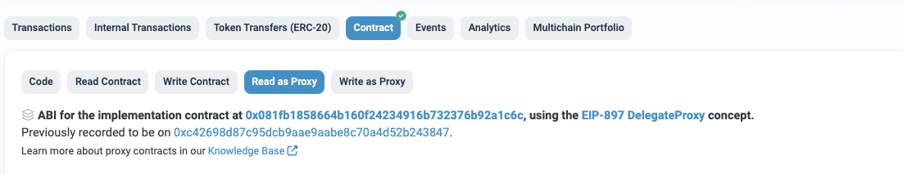

# **How to Check LTOS**

> LTOS is a token issued when TOS is staked.
> You can check the LTOS balance through the StakingV2Proxy contract.
> 
- StakingV2Proxy : [etherscan link](https://etherscan.io/address/0x14fb0933ec45ece75a431d10afaa1ddf7bfee44c#readProxyContract)

You can execute the following functions through the **Read as Proxy** page.

---

### **possibleIndex()**
Returns the LTOS index if rebaseIndex() gets called right now. If you are unstaking, the unstaking function will call rebaseIndex() as a routine to ensure that you get the most updated staking rewards.
- Result
    - possibleIndex: this represent number of TOS per LTOS in wei (10^18). To get the decimal value, divide this by 10^18. 
---

### **balanceOf(address _addr)**

Checks the LTOS balance (staked TOS principal) of a specific account.

- Parameters
    - address _addr: The account address to be queried
- Result
    - uint256 balance: LTOS (staked TOS principal) balance (wei unit, 18 decimals)

---

### **getLtosToTosPossibleIndex(uint256 ltos)**

You can find out the amount of TOS (including interest) when converting a certain amount of LTOS to TOS.

- Parameters
    - uint256 ltos: LTOS amount (wei unit, 18 decimals)
- Result
    - uint256 balance: Converted TOS amount (wei unit, 18 decimals)

---

### **stakingOf(address _addr)**

Retrieves the list of staking IDs staked by a specific account.

- Parameters
    - address _addr: The account address to be queried
- Result
    - uint256[] memory : Returns an array of IDs.
        - The first index is the ID staked without a lock-up period. If there's no staking without a set lock-up period, the first index will be 0 or null.

---

### **stakedOf(uint256 stakeId)**

Checks the amount of TOS held by a specific staking ID.

- Parameters
    - address _addr: The account address to be queried
- Result
    - uint256: TOS amount (wei unit, 18 decimals)

---

### **totalLtos()**

Checks the total amount of staked LTOS.

- Parameters
    - None
- Result
    - uint256: Total amount of staked LTOS (wei unit, 18 decimals)

---

### **stakedOfAll()**

Checks the total amount of staked TOS.

- Parameters
    - None
- Result
    - uint256: Total amount of staked TOS (wei unit, 18 decimals)