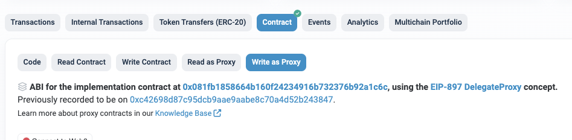

# TOS Staking-Related Functions

> You can perform staking and unstaking through the StakingV2Proxy contract.
- StakingV2Proxy : [etherscan link](https://etherscan.io/address/0x14fb0933ec45ece75a431d10afaa1ddf7bfee44c#writeProxyContract)

You can check the executable functions on the Write as Proxy page of the Etherscan link above.

*********

### [unstake(uint256 _stakeId)](https://etherscan.io/address/0x14fb0933ec45ece75a431d10afaa1ddf7bfee44c#writeProxyContract#F31)

Withdraw interest and principal

- Parameters
    - uint256 _stakeId: stake ID
- Return value
    - None

*********

### [claimForSimpleType(uint256 _stakeId, uint256 claimLtos)](https://etherscan.io/address/0x14fb0933ec45ece75a431d10afaa1ddf7bfee44c#writeProxyContract#F4)

Withdraw interest

- Parameters
    - uint256 _stakeId: stake ID
    - uint256 claimLtos: amount of LTOS to withdraw (wei unit, 18 decimals)
- Return value
    - None

*********

### [stake(uint256 _amount)](https://etherscan.io/address/0x14fb0933ec45ece75a431d10afaa1ddf7bfee44c#writeProxyContract#F24) 

Stake TOS without specifying a lock-up period.

- Parameters
    - uint256 _amount: Staking amount (wei unit, 18 decimals)
- Return value
    - uint256 stakeId: Staking ID

*********

### [stakeGetStos(uint256 _amount, uint256 _periodWeeks)](https://etherscan.io/address/0x14fb0933ec45ece75a431d10afaa1ddf7bfee44c#writeProxyContract#F26)

Staking TOS with a specified lock-up period (setting the staking end date)

- Parameters
    - uint256 _amount : Staking amount (wei unit, 18 decimals)
    - uint256 _periodWeeks : Lock-up period (in weeks)
- Return value
    - uint256 stakeId : Staking ID

*********

### [increaseAmountForSimpleStake(uint256 _stakeId, uint256 _amount)](https://etherscan.io/address/0x14fb0933ec45ece75a431d10afaa1ddf7bfee44c#writeProxyContract#F8)

**Additional TOS staking** for cases where staking was done without specifying a lock-up period

- Parameters
    - uint256 _stakeId: Stake ID
    - uint256 _amount: TOS amount (wei unit, 18 decimals)
- Return value
    - None

*********

### [resetStakeGetStosAfterLock(uint256 _stakeId, uint256 _addTosAmount, uint256 _periodWeeks)](https://etherscan.io/address/0x14fb0933ec45ece75a431d10afaa1ddf7bfee44c#writeProxyContract#F18)

For staking with a lock-up period (cases with an end date), **Additional TOS Staking** before the end of the lock-up period

- Parameters
    - uint256 _stakeId: Stake ID
    - uint256 _addTosAmount: Additional TOS amount to stake (wei unit, 18 decimals)
    - uint256 _periodWeeks: Lock-up period (in weeks)
- Return value
    - None

*********

### [increaseBeforeEndOrNonEnd(uint256 _stakeId, uint256 _amount, uint256 _unlockWeeks)](https://etherscan.io/address/0x14fb0933ec45ece75a431d10afaa1ddf7bfee44c#writeProxyContract#F9)

In case the lock-up period has ended or doesn't exist, **Staking TOS** to a specific staking ID

- Parameters
    - uint256 _stakeId: Stake ID
    - uint256 _amount: Additional TOS amount to stake (wei unit, 18 decimals)
    - uint256 _unlockWeeks: Additional lock-up period (in weeks)
- Return value
    - None

*********