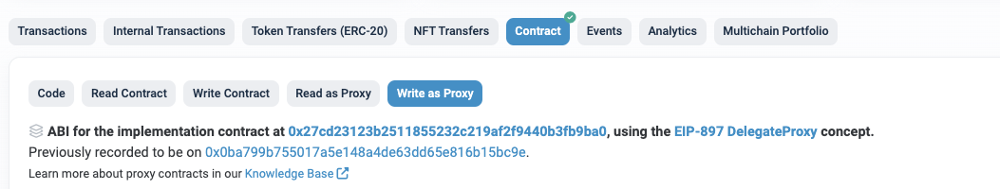

# Treasury

> Through the TreasuryProxy contract, you can exchange the TOS you hold for Ether.
- TreasuryProxy :  [etherscan link](https://etherscan.io/address/0xd27a68a457005f822863199af0f817f672588ad6#writeProxyContract)

You can check the executable functions on the Write as Proxy page of the Etherscan link above.

## View function (View) 

### [claimableEther(uint256 tosAmount)](https://etherscan.io/address/0xd27a68a457005f822863199af0f817f672588ad6#readProxyContract#F18)

Amount of Ether calculated based on the input TOS amount
- Parameter
    - uint256 tosAmount: Amount of TOS (wei unit, 18 decimals)
- Return value
    - uint256: Amount of Ether to be received upon exchange
*********

### [backingRateETHPerTOS()](https://etherscan.io/address/0xd27a68a457005f822863199af0f817f672588ad6#readProxyContract#F8)

Query the Ether exchange rate for 1 TOS
- Parameter
    - None
- Return value
    - uint256: Amount of Ether received for 1 TOS (in wei, 18 decimals)
*********

## Function execution (Transaction)

### [claim(uint256 tosAmount)](https://etherscan.io/address/0xd27a68a457005f822863199af0f817f672588ad6#writeProxyContract#F6)
Redeem ETH by burning your TOS
- Parameters
  - uint256 tosAmount: Amount of TOS (wei unit, 18 decimals)
- Return Value
  - None

****

### [setClaimPause(bool _pause)](https://etherscan.io/address/0xd27a68a457005f822863199af0f817f672588ad6#writeProxyContract#F21)
Execute pause/resume of exchange function, only executable by PolicyOwner
- Parameters
    - bool _pause : true to pause exchange, false to enable exchange
- Return Value
    - None

****

### [setClaimableStartTime(uint32 _startTime)](https://etherscan.io/address/0xd27a68a457005f822863199af0f817f672588ad6#writeProxyContract#F22)

Set exchange start time, function only executable by PolicyOwner
- Parameters
    - uint32 _startTime : Exchange start time
- Return Value
    - None

*********

