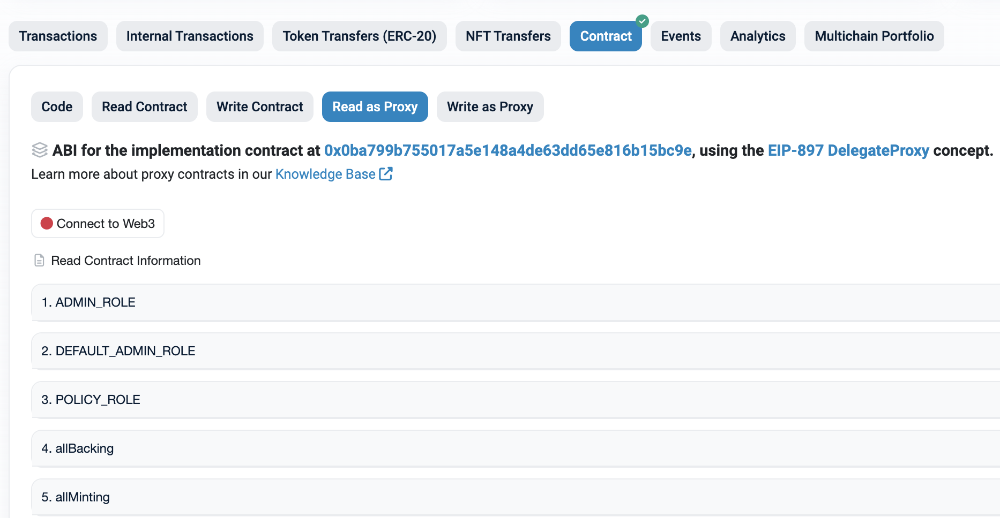
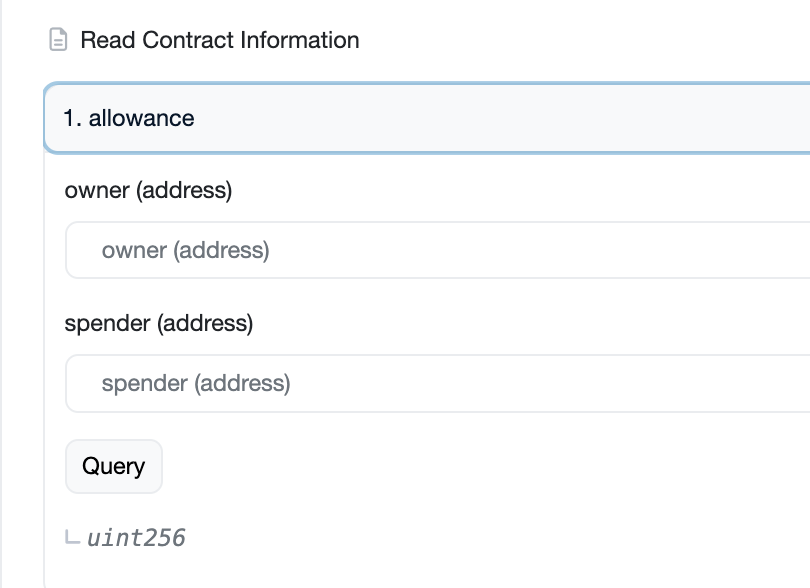
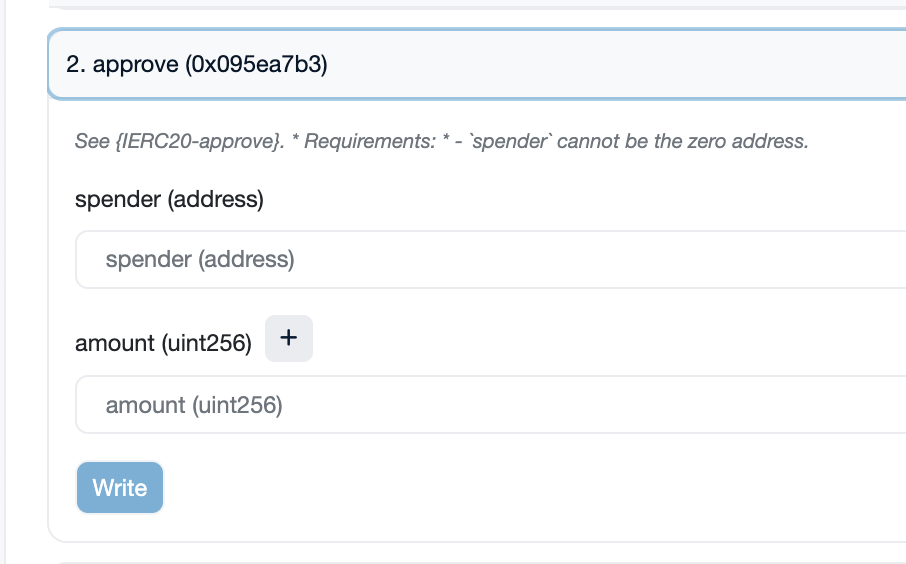

# Contract interaction using etherscan

> You can connect your wallet on Etherscan to call contract functions.

You can use the functions on the Read Contract or Read As Proxy page for query functions, and you can call transaction functions using the functions on the Write Contract or Write As Proxy page.

## Executing queries

When you check the Read Contract or Read As Proxy page of the respective contract, you can see the functions available for querying. You can input parameters according to the desired function's interface and click the call button to view the query results.

When parameters are required for querying, a parameter input screen will appear as shown in the image below. Enter the parameters and click the query button to execute the query.

## Executing Transactions

To execute a transaction, you must first connect your address at the top.

You can see the transaction functions by checking the Write Contract or Write As Proxy page of the corresponding contract. Enter the parameters according to the desired function's interface, and click the 'Write' button to execute the transaction.

When executing a transaction that requires parameters, a parameter input screen will appear as shown in the image below. Enter the parameters and click the Write button to execute the transaction.

