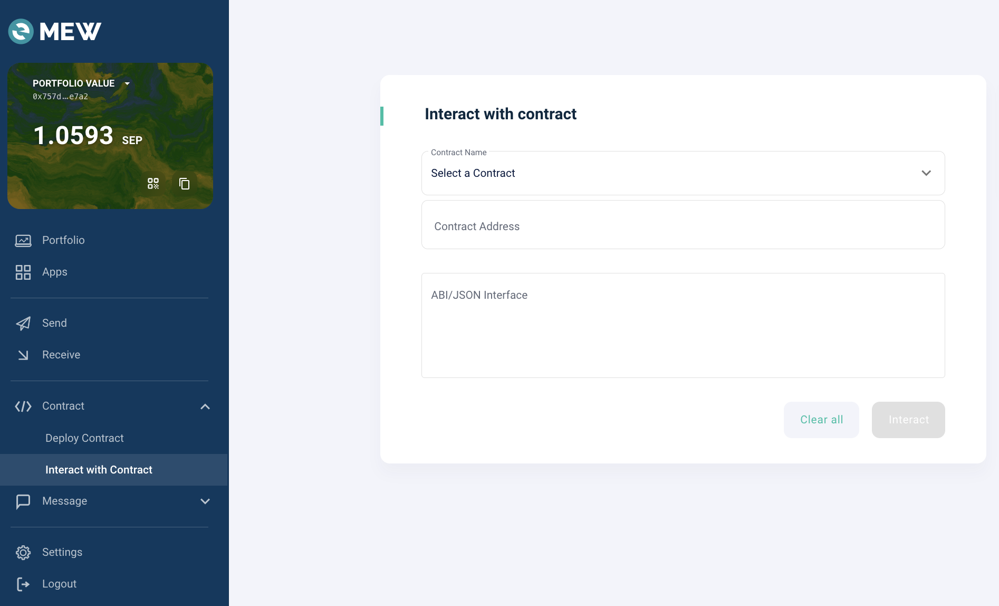

# How to check sTOS
> You can check the sTOS balance of a specific account and the total sTOS issuance through the LockTOSProxy contract. In the case of the LockTOSProxy contract, since balance inquiry functions are not displayed on Etherscan, you can use sites like MyEtherWallet to check the balance.

Log in to the [MyEtherWallet](https://www.myetherwallet.com/wallet/dashboard) site. Users who use MetaMask wallet can connect their wallet by clicking on the 'Browser extension' menu below.


Navigate to the 'Interact with contract' menu.


Enter the LockTOSProxy address in the contract address field, and input the following content in the ABI area:
LockTOSProxy address (mainnet):
0x69b4A202Fa4039B42ab23ADB725aA7b1e9EEBD79

```
[
	{
	  "inputs": [
	    {
	      "internalType": "address",
	      "name": "_addr",
	      "type": "address"
	    }
	  ],
	  "name": "balanceOf",
	  "outputs": [
	    {
	      "internalType": "uint256",
	      "name": "balance",
	      "type": "uint256"
	    }
	  ],
	  "stateMutability": "view",
	  "type": "function"
	},
	 {
	  "inputs": [],
	  "name": "totalSupply",
	  "outputs": [
	    {
	      "internalType": "uint256",
	      "name": "",
	      "type": "uint256"
	    }
	  ],
	  "stateMutability": "view",
	  "type": "function"
	}
]
```

## Functions
By clicking the next button, you can call the functions specified in the ABI entered above.


**************

### balanceOf(address _addr)

Retrieves the STOS balance of a specific account.

- Parameters
    - address _addr: The address to be queried
- Return value
    - STOS balance of the specific account (in wei unit, 18 decimals)

*********

### totalSupply() 

Checks the total supply of STOS.

- Parameters: None
- Return value
    - Total supply of STOS (in wei unit, 18 decimals)

**************
