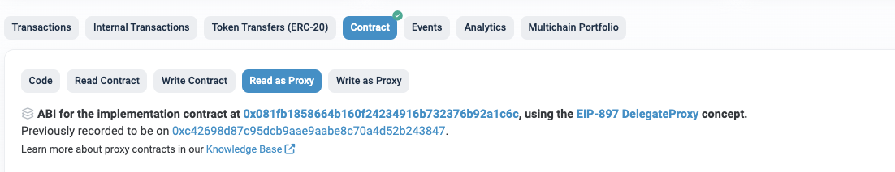

# LTOS 조회 방법 

> LTOS는 TOS를 스테이킹 했을 때 발행되는 토큰입니다.
> StakingV2Proxy 컨트랙을 통해 LTOS 잔액을 조회할 수 있습니다.

- Mainnet StakingV2Proxy : [etherscan link](https://etherscan.io/address/0x14fb0933ec45ece75a431d10afaa1ddf7bfee44c#readProxyContract)

**Read as Proxy** 페이지의 함수를 통해 아래와 같은 기능을 실행할 수 있습니다.

*********

### [balanceOf(address _addr)](https://etherscan.io/address/0x14fb0933ec45ece75a431d10afaa1ddf7bfee44c#readProxyContract#F5)

특정 계정의 LTOS 잔액 조회합니다. 

- 파라미터
  - address _addr : 조회대상이 되는 계정주소 
- 결과
  - uint256 balance: LTOS 잔액 (wei unit, 18 decimals) 

*********

### getLtosToTosPossibleIndex(uint256 ltos)

얼마의 LTOS를 TOS로 환산했을 때, TOS 양을 알 수 있습니다.

- 파라미터
  - uint256 ltos:  LTOS 양 (wei unit, 18 decimals)
- 결과
  - uint256 balance: 변환된 TOS 양 (wei unit, 18 decimals) 

*********

### stakingOf(address _addr)

특정 계정이 스테이킹한 스테이킹 아이디 목록을 조회합니다.

- 파라미터
  - address _addr : 조회대상이 되는 계정주소
- 결과값
  - uint256[] memory : 아이디 배열을 리턴합니다.
    - 첫번째 인덱스는 락업기간이 없이 스테이킹한 아이디입니다. 락업기간을 정하지 않고 스테이킹한 것이 없는 경우, 첫번째 인덱스가 0이거나 null 입니다.

********

### stakedOf(uint256 stakeId)

특정 스테이킹 아이디가 보유하고 있는 TOS양을 조회합니다.

- 파라미터
  - address _addr : 조회대상이 되는 계정주소
- 결과값
  - uint256:  TOS 양  (wei unit, 18 decimals)

********

### totalLtos()

스테이킹된 총 LTOS양을 조회합니다.

- 파라미터
  - 없음
- 결과값
  - uint256 : 스테이킹된 총 LTOS 양 (wei unit, 18 decimals)

********

### stakedOfAll()

스테이킹된 총 TOS 양을 조회합니다.

- 파라미터
  - 없음
- 결과값
  - uint256 :  스테이킹된 총 TOS 양 (wei unit, 18 decimals)

********

### 

