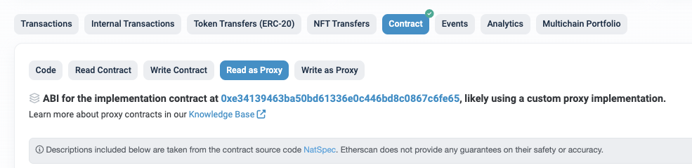
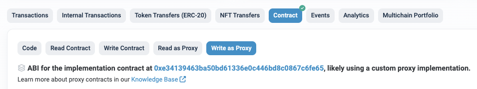

# Reward Program

> 톤스타터 > Reward Program 에서는 UniswapV3Staker 컨트랙을 통해 리워드를 제공하거나 받을 수 있습니다.

- UniswapV3Staker : [etherscan link](https://etherscan.io/address/0xe34139463bA50bD61336E0c446Bd8C0867c6fE65#readProxyContract) 


## 조회함수

조회 함수는 ***Read as Proxy*** 를 통해서 호출 할 수 있습니다.  




### [incentives(bytes32 incentiveId)](https://etherscan.io/address/0xe34139463bA50bD61336E0c446Bd8C0867c6fE65#readProxyContract#F4)

| 기능     | 리워드 프로그램 조회                                         |
| -------- | ------------------------------------------------------------ |
| 설명     | Represents a staking incentive                               |
| 함수이름 | function incentives(bytes32 incentiveId) external            |
| 파라미터 | incentiveId The ID of the incentive computed from its parameters |
| 결과     | - totalRewardUnclaimed The amount of reward token not yet claimed by users <br/>- totalSecondsClaimedX128 Total liquidity-seconds claimed, represented as a UQ32.128 <br/> - numberOfStakes The count of deposits that are currently staked for the incentive <br/> |


### [deposits(uint256 tokenId)](https://etherscan.io/address/0xe34139463bA50bD61336E0c446Bd8C0867c6fE65#readProxyContract#F1)

| 기능     | 예치한 NFT 정보 조회                                         |
| -------- | ------------------------------------------------------------ |
| 설명     | Returns information about a deposited NFT                    |
| 함수이름 | function deposits(uint256 tokenId) external                  |
| 파라미터 | uint256 tokenId : LP 아이디                                  |
| 결과     | - owner The owner of the deposited NFT <br/>- numberOfStakes Counter of how many incentives for which the liquidity is staked<br/> - tickLower The lower tick of the range <br/> -tickUpper The upper tick of the range |

 ### [rewards(IERC20Minimal rewardToken, address owner)](https://etherscan.io/address/0xe34139463bA50bD61336E0c446Bd8C0867c6fE65#readProxyContract#F8)

| 기능     | 특정 계정이 보유한 리워드 토큰 개수 조회                     |
| -------- | ------------------------------------------------------------ |
| 설명     | Returns amounts of reward tokens owed to a given address according to the last time all stakes were updated |
| 함수이름 | function rewards(IERC20Minimal rewardToken, address owner) external |
| 파라미터 | - rewardToken The token for which to check rewards <br/>- owner The owner for which the rewards owed are checked |
| 결과     | - rewardsOwed The amount of the reward token claimable by the owner |


## 실행함수

실행함수는 ***Write as Proxy*** 페이지를 통해서 실행할 수 있습니다. 



 

 ### [createIncentive(IncentiveKey memory key, uint256 reward)](https://etherscan.io/address/0xe34139463bA50bD61336E0c446Bd8C0867c6fE65#writeProxyContract#F2)
| 기능 | 리워드 프로그램 만들기 |
| -------- | -------- |
| 설명	|  Creates a new liquidity mining incentive program|
|함수이름  |  function createIncentive(IncentiveKey memory key, uint256 reward) external |
| 파라미터| - key Details of the incentive to create <br/>- reward The amount of reward tokens to be distributed|
| 추가 설명| 리워드 토큰은 사전에 uniswpV3Staker 컨트랙에 사용할 금액만큼 approve 되어야 한다 |
| 스크립트 예제 | const tos = await ethers.getContractAt("TOS", reward); <br/>const totalReward = ethers.BigNumber.from('100000000000000000000')<br/>await tos.connect(_creator).approve(uniswapV3Staker, totalReward);	<br/>let allowAmount = await tos.connect(_creator).allowance(_creator.address, uniswapV3Staker);<br/>const staker = new ethers.Contract(uniswapV3Staker, STAKER_ABI);<br/>const key = {<br/>      rewardToken: reward,<br/>      pool: pool,<br/>      startTime: parseInt(start),<br/>      endTime: parseInt(end),<br/>      refundee: creator,<br/>    } <br/>const tx = await staker.connect(_creator).createIncentive(<br/>    key,<br/>    totalReward<br/>  )<br/>await tx.wait();|
| 결과|- rewardsOwed The amount of the reward token claimable by the owner|


### [endIncentive(IncentiveKey memory key)](https://etherscan.io/address/0xe34139463bA50bD61336E0c446Bd8C0867c6fE65#writeProxyContract#F3)
| 기능 | 리워드 프로그램 종료하기 |
| -------- | -------- |
| 설명	|  Ends an incentive after the incentive end time has passed and all stakes have been withdrawn |
|함수이름  |  function endIncentive(IncentiveKey memory key) external |
| 파라미터|  key Details of the incentive to end|
| 결과|- refund The remaining reward tokens when the incentive is ended |


### [transferDeposit(uint256 tokenId, address to)](https://etherscan.io/address/0xe34139463bA50bD61336E0c446Bd8C0867c6fE65#writeProxyContract#F7)
| 기능 | 예치토큰 전송하기  |
| -------- | -------- |
| 설명	|  Transfers ownership of a deposit from the sender to the given recipient|
|함수이름  |  function transferDeposit(uint256 tokenId, address to)  external |
| 파라미터|  key Details of the incentive to end|
| 결과|-  tokenId The ID of the token (and the deposit) to transfer <br/>-  to The new owner of the deposit |


### [withdrawToken(uint256 tokenId, address to,bytes memory data)](https://etherscan.io/address/0xe34139463bA50bD61336E0c446Bd8C0867c6fE65#writeProxyContract#F9)
| 기능 | 리워드 프로그램에서 LP 토큰 인출하기 |
| -------- | -------- |
| 설명	|  Withdraws a Uniswap V3 LP token tokenId from this contract to the recipient to |
|함수이름  |  function withdrawToken(<br/>uint256 tokenId,<br/>address to,<br/>bytes memory data<br/>)  external |
| 파라미터|-  tokenId The unique identifier of an Uniswap V3 LP token<br/>-  to The address where the LP token will be sent<br/>-  data An optional data array that will be passed along to the to address via the NFT safeTransferFrom|


### 리워드 프로그램에 LP 스테이킹 하기 (방법1)
| 기능 | 리워드 프로그램에 LP 스테이킹 하기 (방법1) |
| -------- | -------- |
| 설명	|  Stakes a Uniswap V3 LP token <br/>Upon receiving a Uniswap V3 ERC721, creates the token deposit setting owner to from. Also stakes token in one or more incentives if properly formatted data has a length > 0.|
|함수이름  |  function onERC721Received(address, address from,uint256 tokenId,bytes calldata data)  external |
| 파라미터 |-  address, <br/>-  address from, <br/>-  uint256 tokenId,<br/>-  bytes calldata data |
| 추가 설명|NonfungiblePositionManager 컨트랙에서 sender는 uniswpV3Staker 컨트랙에 setApprovalForAll 함수를 통해 승인해야 한다.<br/>onERC721Received 는 ERC721 컨트랙의 transfer함수의 콜백 함수로 실행되는 함수이다. 따라서,  NonfungiblePositionManager 의 TokenId를 uniswpV3Staker 에 보냄으로써 호출된다. |
| 스크립트 예제|    const incentiveKeyAbi =<br/>  'tuple(address rewardToken, address pool, uint256 startTime, uint256 endTime, address refundee)'<br/><br/>      // this is the reward program's incentiveKey  <br/>      let key1 =  {<br/>          rewardToken: '0x73a54e5C054aA64C1AE7373C2B5474d8AFEa08bd',<br/>          pool: '0x516e1af7303a94f81e91e4ac29e20f4319d4ecaf',<br/>          startTime: 1632833326,<br/>          endTime: 1635425326,<br/>          refundee: '0x3b9878Ef988B086F13E5788ecaB9A35E74082ED9'<br/>       }<br/><br/>      let key2 = {<br/>        rewardToken: '0x73a54e5C054aA64C1AE7373C2B5474d8AFEa08bd',<br/>        pool: '0x516e1af7303a94f81e91e4ac29e20f4319d4ecaf',<br/>        startTime: 1632834379,<br/>        endTime: 1635392658,<br/>        refundee: '0x3b9878Ef988B086F13E5788ecaB9A35E74082ED9'<br/>      }<br/><br/>      const incentiveKeyAbi =<br/>        'tuple(address rewardToken, address pool, uint256 startTime, uint256 endTime, address refundee)'<br/><br/>      let arraykey = [key1, key2];<br/>      let arraydata = arraykey.map(incentiveResultToStakeAdapter) <br/><br/>      let data = ethers.utils.defaultAbiCoder.encode([`${incentiveKeyAbi}[]`], [arraydata])<br/><br/>      const npm = new ethers.Contract(nonfungiblePositionManager, NPM_ABI);<br/>      const staker = new ethers.Contract(uniswapV3Staker, STAKER_ABI);<br/><br/>      const tx = await npm.connect(_sender).safeTransferFrom(sender, uniswapV3Staker, tokenid, data)<br/>      console.log('safeTransferFrom tx',tx.hash);<br/>      await tx.wait(); <br/>|


 ### [stakeToken(IncentiveKey memory key, uint256 tokenId)](https://etherscan.io/address/0xe34139463bA50bD61336E0c446Bd8C0867c6fE65#writeProxyContract#F6)
| 기능 | 리워드 프로그램에 LP 스테이킹 하기 (방법2) |
| -------- | -------- |
| 설명	|  Stakes a Uniswap V3 LP token|
|함수이름  |  function  stakeToken(IncentiveKey memory key, uint256 tokenId)  external |
| 파라미터| - key The key of the incentive for which to stake the NFT <br/>-  tokenId The ID of the token to stake|

 ### [unstakeToken(IncentiveKey memory key, uint256 tokenId)](https://etherscan.io/address/0xe34139463bA50bD61336E0c446Bd8C0867c6fE65#writeProxyContract#F8)
| 기능 | 프로그램에 스테이킹한 LP 언스테이킹 하기 |
| -------- | -------- |
| 설명	|  Unstakes a Uniswap V3 LP token|
|함수이름  |  function unstakeToken(IncentiveKey memory key, uint256 tokenId) external |
| 파라미터| - - key The key of the incentive for which to stake the NFT <br/>-  tokenId The ID of the token to stake|

 ### [claimReward](https://etherscan.io/address/0xe34139463bA50bD61336E0c446Bd8C0867c6fE65#writeProxyContract#F1)
| 기능 | 리워드 클래임하기 |
| -------- | -------- |
| 설명	|  Transfers amountRequested of accrued rewardToken rewards from the contract to the recipient to|
|함수이름  |  function claimReward(<br/>IERC20Minimal rewardToken,<br/>address to,<br/>uint256 amountRequested<br/>) external |
| 파라미터| - rewardToken The token being distributed as a reward <br/>-  to The address where claimed rewards will be sent to<br/>-amountRequested The amount of reward tokens to claim. Claims entire reward amount if set to 0.|
| 결과|- reward The amount of reward tokens claimed|


 ## UniswapV3Staker  Contract Information

 - etherscan [link](https://etherscan.io/address/0xe34139463bA50bD61336E0c446Bd8C0867c6fE65)
- Repo : https://github.com/Uniswap/v3-staker
-  [deployed address](https://github.com/Uniswap/v3-staker/releases/tag/v1.0.2) :    0xe34139463bA50bD61336E0c446Bd8C0867c6fE65
- [Document](https://docs.uniswap.org/contracts/v3/reference/periphery/staker/UniswapV3Staker)
- Interface : https://github.com/Uniswap/v3-staker/blob/main/contracts/interfaces/IUniswapV3Staker.sol
- [UniswapV3 deployement addresses](https://docs.uniswap.org/contracts/v3/reference/deployments/ethereum-deployments)
- struct
```
/// @param rewardToken The token being distributed as a reward
/// @param pool The Uniswap V3 pool
/// @param startTime The time when the incentive program begins
/// @param endTime The time when rewards stop accruing
/// @param refundee The address which receives any remaining reward tokens when the incentive is ended
struct IncentiveKey {
    IERC20Minimal rewardToken;
    IUniswapV3Pool pool;
    uint256 startTime;
    uint256 endTime;
    address refundee;
}
```


## 리워드 프로그램 Key Detailed 


| Token Pair  | Pool Address | 리워드 토큰 | Program Key |
| -------- | -------- | -------- | -------- |
|TOS / WETH	|0x2ad99c938471770da0cd60e08eaf29ebff67a92a	|0x409c4D8cd5d2924b9bc5509230d16a61289c8153	|{"rewardToken":"0x409c4D8cd5d2924b9bc5509230d16a61289c8153","pool":"0x2ad99c938471770da0cd60e08eaf29ebff67a92a","startTime":1638801000,"endTime":1641430800,"refundee":"0x0496B93040E1c7931C8f9b7D1c57787ceb6485d4"}|
|TOS / WTON	|0x1c0ce9aaa0c12f53df3b4d8d77b82d6ad343b4e4	|0x409c4D8cd5d2924b9bc5509230d16a61289c8153	|{"rewardToken":"0x409c4D8cd5d2924b9bc5509230d16a61289c8153","pool":"0x1c0ce9aaa0c12f53df3b4d8d77b82d6ad343b4e4","startTime":1638752400,"endTime":1641430800,"refundee":"0x0496B93040E1c7931C8f9b7D1c57787ceb6485d4"}|
|TOS / WTON	|0x1c0ce9aaa0c12f53df3b4d8d77b82d6ad343b4e4	|0x0e498afce58de8651b983f136256fa3b8d9703bc	|{"rewardToken":"0x0e498afce58de8651b983f136256fa3b8d9703bc","pool":"0x1c0ce9aaa0c12f53df3b4d8d77b82d6ad343b4e4","startTime":1638752400,"endTime":1641430800,"refundee":"0xc575848f69c710da33a978384114010bdb15f4db"}|
|DOC / TOS	|0x369bca127b8858108536b71528ab3befa1deb6fc	|0x0e498afce58dE8651B983F136256fA3b8d9703bc	|{"rewardToken":"0x0e498afce58dE8651B983F136256fA3b8d9703bc","pool":"0x369bca127b8858108536b71528ab3befa1deb6fc","startTime":1638799200,"endTime":1641430800,"refundee":"0xc575848f69C710dA33A978384114010bdb15f4db"}|
|WETH / WTON|0xc29271e3a68a7647fd1399298ef18feca3879f59	|0x2be5e8c109e2197D077D13A82dAead6a9b3433C5	|{"rewardToken":"0x2be5e8c109e2197D077D13A82dAead6a9b3433C5","pool":"0xc29271e3a68a7647fd1399298ef18feca3879f59","startTime":1639098000,"endTime":1641776400,"refundee":"0x340C44089bc45F86060922d2d89eFee9e0CDF5c7"}|
|TOS / WETH|	0x2ad99c938471770da0cd60e08eaf29ebff67a92a	|0x2be5e8c109e2197D077D13A82dAead6a9b3433C5	|{"rewardToken":"0x2be5e8c109e2197D077D13A82dAead6a9b3433C5","pool":"0x2ad99c938471770da0cd60e08eaf29ebff67a92a","startTime":1639098000,"endTime":1641776400,"refundee":"0x340C44089bc45F86060922d2d89eFee9e0CDF5c7"}|
|TOS / WTON	|0x1c0ce9aaa0c12f53df3b4d8d77b82d6ad343b4e4|	0x2be5e8c109e2197d077d13a82daead6a9b3433c5	|{"rewardToken":"0x2be5e8c109e2197d077d13a82daead6a9b3433c5","pool":"0x1c0ce9aaa0c12f53df3b4d8d77b82d6ad343b4e4","startTime":1639098000,"endTime":1641776400,"refundee":"0x340c44089bc45f86060922d2d89efee9e0cdf5c7"}|
|TOS / WTON|	0x1c0ce9aaa0c12f53df3b4d8d77b82d6ad343b4e4	|0x409c4D8cd5d2924b9bc5509230d16a61289c8153	|{"rewardToken":"0x409c4D8cd5d2924b9bc5509230d16a61289c8153","pool":"0x1c0ce9aaa0c12f53df3b4d8d77b82d6ad343b4e4","startTime":1640055599,"endTime":1642733999,"refundee":"0x340C44089bc45F86060922d2d89eFee9e0CDF5c7"}|
|TOS / WTON|	0x1c0ce9aaa0c12f53df3b4d8d77b82d6ad343b4e4|	0xaEC59E5b4f8DbF513e260500eA96EbA173F74149|	{"rewardToken":"0xaEC59E5b4f8DbF513e260500eA96EbA173F74149","pool":"0x1c0ce9aaa0c12f53df3b4d8d77b82d6ad343b4e4","startTime":1640163600,"endTime":1642755600,"refundee":"0x340C44089bc45F86060922d2d89eFee9e0CDF5c7"}|
|TOS / AURA|	0xbddd3a50bd2afd27aed05cc9fe1c8d67fcaa3218|	0xaEC59E5b4f8DbF513e260500eA96EbA173F74149|	{"rewardToken":"0xaEC59E5b4f8DbF513e260500eA96EbA173F74149","pool":"0xbddd3a50bd2afd27aed05cc9fe1c8d67fcaa3218","startTime":1640163600,"endTime":1642755600,"refundee":"0x340C44089bc45F86060922d2d89eFee9e0CDF5c7"}|
|TOS / AURA|	0xbddd3a50bd2afd27aed05cc9fe1c8d67fcaa3218|	0xc4A11aaf6ea915Ed7Ac194161d2fC9384F15bff2	|{"rewardToken":"0xc4A11aaf6ea915Ed7Ac194161d2fC9384F15bff2","pool":"0xbddd3a50bd2afd27aed05cc9fe1c8d67fcaa3218","startTime":1640401140,"endTime":1642755600,"refundee":"0x340C44089bc45F86060922d2d89eFee9e0CDF5c7"}|
|DOC / TOS	|0x369bca127b8858108536b71528ab3befa1deb6fc|	0x0e498afce58dE8651B983F136256fA3b8d9703bc	|{"rewardToken":"0x0e498afce58dE8651B983F136256fA3b8d9703bc","pool":"0x369bca127b8858108536b71528ab3befa1deb6fc","startTime":1641430800,"endTime":1644048000,"refundee":"0x340C44089bc45F86060922d2d89eFee9e0CDF5c7"}|
|TOS / WTON|	0x1c0ce9aaa0c12f53df3b4d8d77b82d6ad343b4e4|	0x0e498afce58dE8651B983F136256fA3b8d9703bc|	{"rewardToken":"0x0e498afce58dE8651B983F136256fA3b8d9703bc","pool":"0x1c0ce9aaa0c12f53df3b4d8d77b82d6ad343b4e4","startTime":1641430800,"endTime":1644048000,"refundee":"0x340C44089bc45F86060922d2d89eFee9e0CDF5c7"}|
|TOS / AURA|	0xbddd3a50bd2afd27aed05cc9fe1c8d67fcaa3218|	0xc4A11aaf6ea915Ed7Ac194161d2fC9384F15bff2|	{"rewardToken":"0xc4A11aaf6ea915Ed7Ac194161d2fC9384F15bff2","pool":"0xbddd3a50bd2afd27aed05cc9fe1c8d67fcaa3218","startTime":1641891600,"endTime":1644570000,"refundee":"0x340C44089bc45F86060922d2d89eFee9e0CDF5c7"}|
|TOS / AURA|	0xbddd3a50bd2afd27aed05cc9fe1c8d67fcaa3218|	0xaEC59E5b4f8DbF513e260500eA96EbA173F74149	|{"rewardToken":"0xaEC59E5b4f8DbF513e260500eA96EbA173F74149","pool":"0xbddd3a50bd2afd27aed05cc9fe1c8d67fcaa3218","startTime":1642757400,"endTime":1645520400,"refundee":"0x340C44089bc45F86060922d2d89eFee9e0CDF5c7"}|
|TOS / WTON|	0x1c0ce9aaa0c12f53df3b4d8d77b82d6ad343b4e4|	0xaEC59E5b4f8DbF513e260500eA96EbA173F74149	|{"rewardToken":"0xaEC59E5b4f8DbF513e260500eA96EbA173F74149","pool":"0x1c0ce9aaa0c12f53df3b4d8d77b82d6ad343b4e4","startTime":1642757400,"endTime":1645520400,"refundee":"0x340C44089bc45F86060922d2d89eFee9e0CDF5c7"}|
|WETH / WTON|	0xc29271e3a68a7647fd1399298ef18feca3879f59|	0x2be5e8c109e2197D077D13A82dAead6a9b3433C5	|{"rewardToken":"0x2be5e8c109e2197D077D13A82dAead6a9b3433C5","pool":"0xc29271e3a68a7647fd1399298ef18feca3879f59","startTime":1642757400,"endTime":1643965200,"refundee":"0x340C44089bc45F86060922d2d89eFee9e0CDF5c7"}|
|TOS / WTON|	0x1c0ce9aaa0c12f53df3b4d8d77b82d6ad343b4e4	|0x2be5e8c109e2197D077D13A82dAead6a9b3433C5|{"rewardToken":"0x2be5e8c109e2197D077D13A82dAead6a9b3433C5","pool":"0x1c0ce9aaa0c12f53df3b4d8d77b82d6ad343b4e4","startTime":1642757400,"endTime":1643965200,"refundee":"0x340C44089bc45F86060922d2d89eFee9e0CDF5c7"}|
|TOS / WETH|	0x2ad99c938471770da0cd60e08eaf29ebff67a92a|	0x2be5e8c109e2197D077D13A82dAead6a9b3433C5	|{"rewardToken":"0x2be5e8c109e2197D077D13A82dAead6a9b3433C5","pool":"0x2ad99c938471770da0cd60e08eaf29ebff67a92a","startTime":1642757400,"endTime":1643965200,"refundee":"0x340C44089bc45F86060922d2d89eFee9e0CDF5c7"}|
|DOC / TOS|	0x369bca127b8858108536b71528ab3befa1deb6fc|	0x0e498afce58dE8651B983F136256fA3b8d9703bc	|{"rewardToken":"0x0e498afce58dE8651B983F136256fA3b8d9703bc","pool":"0x369bca127b8858108536b71528ab3befa1deb6fc","startTime":1644404400,"endTime":1646823600,"refundee":"0x340C44089bc45F86060922d2d89eFee9e0CDF5c7"}|
|TOS / WTON|	0x1c0ce9aaa0c12f53df3b4d8d77b82d6ad343b4e4|	0x0e498afce58dE8651B983F136256fA3b8d9703bc	|{"rewardToken":"0x0e498afce58dE8651B983F136256fA3b8d9703bc","pool":"0x1c0ce9aaa0c12f53df3b4d8d77b82d6ad343b4e4","startTime":1644404400,"endTime":1646823600,"refundee":"0x340C44089bc45F86060922d2d89eFee9e0CDF5c7"}|
|TOS / AURA	|0xbddd3a50bd2afd27aed05cc9fe1c8d67fcaa3218	|0xaEC59E5b4f8DbF513e260500eA96EbA173F74149	|{"rewardToken":"0xaEC59E5b4f8DbF513e260500eA96EbA173F74149","pool":"0xbddd3a50bd2afd27aed05cc9fe1c8d67fcaa3218","startTime":1645524000,"endTime":1647939600,"refundee":"0x340C44089bc45F86060922d2d89eFee9e0CDF5c7"}|
TOS / WTON | 	0x1c0ce9aaa0c12f53df3b4d8d77b82d6ad343b4e4	 | 0xaEC59E5b4f8DbF513e260500eA96EbA173F74149	 | {"rewardToken":"0xaEC59E5b4f8DbF513e260500eA96EbA173F74149","pool":"0x1c0ce9aaa0c12f53df3b4d8d77b82d6ad343b4e4","startTime":1645524000,"endTime":1647939600,"refundee":"0x340C44089bc45F86060922d2d89eFee9e0CDF5c7"} |
|DOC / WETH	|0xda3cc73170aa5bb7c0a9588e7690299df568d53d|	0x0e498afce58dE8651B983F136256fA3b8d9703bc	|{"rewardToken":"0x0e498afce58dE8651B983F136256fA3b8d9703bc","pool":"0xda3cc73170aa5bb7c0a9588e7690299df568d53d","startTime":1646823600,"endTime":1649059200,"refundee":"0x340C44089bc45F86060922d2d89eFee9e0CDF5c7"}|
|DOC / TOS|	0x369bca127b8858108536b71528ab3befa1deb6fc|	0x0e498afce58dE8651B983F136256fA3b8d9703bc	|{"rewardToken":"0x0e498afce58dE8651B983F136256fA3b8d9703bc","pool":"0x369bca127b8858108536b71528ab3befa1deb6fc","startTime":1646823600,"endTime":1649059200,"refundee":"0x340C44089bc45F86060922d2d89eFee9e0CDF5c7"}|
|TOS / WTON|	0x1c0ce9aaa0c12f53df3b4d8d77b82d6ad343b4e4	|0x0e498afce58dE8651B983F136256fA3b8d9703bc	|{"rewardToken":"0x0e498afce58dE8651B983F136256fA3b8d9703bc","pool":"0x1c0ce9aaa0c12f53df3b4d8d77b82d6ad343b4e4","startTime":1646823600,"endTime":1649059200,"refundee":"0x340C44089bc45F86060922d2d89eFee9e0CDF5c7"}|
|TOS / AURA|	0xbddd3a50bd2afd27aed05cc9fe1c8d67fcaa3218|	0xaEC59E5b4f8DbF513e260500eA96EbA173F74149	|{"rewardToken":"0xaEC59E5b4f8DbF513e260500eA96EbA173F74149","pool":"0xbddd3a50bd2afd27aed05cc9fe1c8d67fcaa3218","startTime":1647941400,"endTime":1650704400,"refundee":"0x340C44089bc45F86060922d2d89eFee9e0CDF5c7"}|
|TOS / WTON	|0x1c0ce9aaa0c12f53df3b4d8d77b82d6ad343b4e4	|0xaEC59E5b4f8DbF513e260500eA96EbA173F74149	|{"rewardToken":"0xaEC59E5b4f8DbF513e260500eA96EbA173F74149","pool":"0x1c0ce9aaa0c12f53df3b4d8d77b82d6ad343b4e4","startTime":1647941400,"endTime":1650704400,"refundee":"0x340C44089bc45F86060922d2d89eFee9e0CDF5c7"}|
|DOC / TOS|	0x369bca127b8858108536b71528ab3befa1deb6fc|	0x0e498afce58dE8651B983F136256fA3b8d9703bc	|{"rewardToken":"0x0e498afce58dE8651B983F136256fA3b8d9703bc","pool":"0x369bca127b8858108536b71528ab3befa1deb6fc","startTime":1649178000,"endTime":1651942800,"refundee":"0x986D9bB496AbD602ffbab9291a2621834f0f03a3"}|
|TOS / WTON|	0x1c0ce9aaa0c12f53df3b4d8d77b82d6ad343b4e4|0x0e498afce58dE8651B983F136256fA3b8d9703bc	|{"rewardToken":"0x0e498afce58dE8651B983F136256fA3b8d9703bc","pool":"0x1c0ce9aaa0c12f53df3b4d8d77b82d6ad343b4e4","startTime":1649149200,"endTime":1651914000,"refundee":"0x986D9bB496AbD602ffbab9291a2621834f0f03a3"}|
|DOC / WETH|	0xda3cc73170aa5bb7c0a9588e7690299df568d53d	|0x0e498afce58dE8651B983F136256fA3b8d9703bc	|{"rewardToken":"0x0e498afce58dE8651B983F136256fA3b8d9703bc","pool":"0xda3cc73170aa5bb7c0a9588e7690299df568d53d","startTime":1649149200,"endTime":1651914000,"refundee":"0x986D9bB496AbD602ffbab9291a2621834f0f03a3"}|
|TOS / AURA|	0xbddd3a50bd2afd27aed05cc9fe1c8d67fcaa3218|	0xaEC59E5b4f8DbF513e260500eA96EbA173F74149	|{"rewardToken":"0xaEC59E5b4f8DbF513e260500eA96EbA173F74149","pool":"0xbddd3a50bd2afd27aed05cc9fe1c8d67fcaa3218","startTime":1650704400,"endTime":1653382800,"refundee":"0x47462B8062F87F63D84EBB9E0d931d38bD3F6F75"}|
|TOS / WTON|	0x1c0ce9aaa0c12f53df3b4d8d77b82d6ad343b4e4|	0xaEC59E5b4f8DbF513e260500eA96EbA173F74149|	{"rewardToken":"0xaEC59E5b4f8DbF513e260500eA96EbA173F74149","pool":"0x1c0ce9aaa0c12f53df3b4d8d77b82d6ad343b4e4","startTime":1650704400,"endTime":1653382800,"refundee":"0x47462B8062F87F63D84EBB9E0d931d38bD3F6F75"} |
|DOC / TOS|	0x369bca127b8858108536b71528ab3befa1deb6fc|	0x0e498afce58dE8651B983F136256fA3b8d9703bc	|{"rewardToken":"0x0e498afce58dE8651B983F136256fA3b8d9703bc","pool":"0x369bca127b8858108536b71528ab3befa1deb6fc","startTime":1651914000,"endTime":1654506000,"refundee":"0x340C44089bc45F86060922d2d89eFee9e0CDF5c7"}|
|TOS / WTON|	0x1c0ce9aaa0c12f53df3b4d8d77b82d6ad343b4e4|	0x0e498afce58dE8651B983F136256fA3b8d9703bc	|{"rewardToken":"0x0e498afce58dE8651B983F136256fA3b8d9703bc","pool":"0x1c0ce9aaa0c12f53df3b4d8d77b82d6ad343b4e4","startTime":1651914000,"endTime":1654506000,"refundee":"0x340C44089bc45F86060922d2d89eFee9e0CDF5c7"}|
|DOC / WETH|	0xda3cc73170aa5bb7c0a9588e7690299df568d53d|	0x0e498afce58dE8651B983F136256fA3b8d9703bc	|{"rewardToken":"0x0e498afce58dE8651B983F136256fA3b8d9703bc","pool":"0xda3cc73170aa5bb7c0a9588e7690299df568d53d","startTime":1651914000,"endTime":1654506000,"refundee":"0x340C44089bc45F86060922d2d89eFee9e0CDF5c7"}|
|TOS / AURA	|0xbddd3a50bd2afd27aed05cc9fe1c8d67fcaa3218|	0xaEC59E5b4f8DbF513e260500eA96EbA173F74149|	{"rewardToken":"0xaEC59E5b4f8DbF513e260500eA96EbA173F74149","pool":"0xbddd3a50bd2afd27aed05cc9fe1c8d67fcaa3218","startTime":1653382800,"endTime":1655974800,"refundee":"0x340C44089bc45F86060922d2d89eFee9e0CDF5c7"}|
|TOS / WTON|	0x1c0ce9aaa0c12f53df3b4d8d77b82d6ad343b4e4|	0xaEC59E5b4f8DbF513e260500eA96EbA173F74149|	{"rewardToken":"0xaEC59E5b4f8DbF513e260500eA96EbA173F74149","pool":"0x1c0ce9aaa0c12f53df3b4d8d77b82d6ad343b4e4","startTime":1653382800,"endTime":1655974800,"refundee":"0x340C44089bc45F86060922d2d89eFee9e0CDF5c7"}|
|TOS / AURA|	0xbddd3a50bd2afd27aed05cc9fe1c8d67fcaa3218|	0xaEC59E5b4f8DbF513e260500eA96EbA173F74149|	{"rewardToken":"0xaEC59E5b4f8DbF513e260500eA96EbA173F74149","pool":"0xbddd3a50bd2afd27aed05cc9fe1c8d67fcaa3218","startTime":1655974800,"endTime":1658566800,"refundee":"0x340C44089bc45F86060922d2d89eFee9e0CDF5c7"}|
|TOS / WTON	|0x1c0ce9aaa0c12f53df3b4d8d77b82d6ad343b4e4	|0xaEC59E5b4f8DbF513e260500eA96EbA173F74149	|{"rewardToken":"0xaEC59E5b4f8DbF513e260500eA96EbA173F74149","pool":"0x1c0ce9aaa0c12f53df3b4d8d77b82d6ad343b4e4","startTime":1655974800,"endTime":1658566800,"refundee":"0x340C44089bc45F86060922d2d89eFee9e0CDF5c7"}|
|TOS / WTON|	0x1c0ce9aaa0c12f53df3b4d8d77b82d6ad343b4e4	|0xE1B0630D7649CdF503eABc2b6423227Be9605247	|{"rewardToken":"0xE1B0630D7649CdF503eABc2b6423227Be9605247","pool":"0x1c0ce9aaa0c12f53df3b4d8d77b82d6ad343b4e4","startTime":1656224684,"endTime":1658816684,"refundee":"0xA31945830C5a6B225A81962a10E78D2e3793D72D"} |
|TOS / LYDA|	0x3ae1e82f20c134867514ecd1e615856b312fb685	|0xe1b0630d7649cdf503eabc2b6423227be9605247 | {"rewardToken":"0xe1b0630d7649cdf503eabc2b6423227be9605247","pool":"0x3ae1e82f20c134867514ecd1e615856b312fb685","startTime":1656224666,"endTime":1658816666,"refundee":"0x45d08f522bf2b6455fe7eef0f4adf865d76ead08"}|
|TOS / WTON|	0x1c0ce9aaa0c12f53df3b4d8d77b82d6ad343b4e4|	0xaEC59E5b4f8DbF513e260500eA96EbA173F74149	|{"rewardToken":"0xaEC59E5b4f8DbF513e260500eA96EbA173F74149","pool":"0x1c0ce9aaa0c12f53df3b4d8d77b82d6ad343b4e4","startTime":1658736000,"endTime":1661414400,"refundee":"0x340C44089bc45F86060922d2d89eFee9e0CDF5c7"}|
|WTON / TOS|	0x1c0ce9aaa0c12f53df3b4d8d77b82d6ad343b4e4|	0xE1B0630D7649CdF503eABc2b6423227Be9605247|	{"rewardToken":"0xE1B0630D7649CdF503eABc2b6423227Be9605247","pool":"0x1c0ce9aaa0c12f53df3b4d8d77b82d6ad343b4e4","startTime":1660701731,"endTime":1663293731,"refundee":"0xA31945830C5a6B225A81962a10E78D2e3793D72D"}|
|TOS / LYDA|	0x3ae1e82f20c134867514ecd1e615856b312fb685|	0xe1b0630d7649cdf503eabc2b6423227be9605247	|{"rewardToken":"0xe1b0630d7649cdf503eabc2b6423227be9605247","pool":"0x3ae1e82f20c134867514ecd1e615856b312fb685","startTime":1660378515,"endTime":1662970515,"refundee":"0x45d08f522bf2b6455fe7eef0f4adf865d76ead08"}|
|TOS / WTON|	0x1c0ce9aaa0c12f53df3b4d8d77b82d6ad343b4e4	|0xaEC59E5b4f8DbF513e260500eA96EbA173F74149|{"rewardToken":"0xaEC59E5b4f8DbF513e260500eA96EbA173F74149","pool":"0x1c0ce9aaa0c12f53df3b4d8d77b82d6ad343b4e4","startTime":1661414400,"endTime":1664092800,"refundee":"0x340C44089bc45F86060922d2d89eFee9e0CDF5c7"}|
|TOS / LYDA	|0x3ae1e82f20c134867514ecd1e615856b312fb685	|0xe1b0630d7649cdf503eabc2b6423227be9605247	|{"rewardToken":"0xe1b0630d7649cdf503eabc2b6423227be9605247","pool":"0x3ae1e82f20c134867514ecd1e615856b312fb685","startTime":1663384727,"endTime":1665976727,"refundee":"0x45d08f522bf2b6455fe7eef0f4adf865d76ead08"}|
|TOS / LYDA	|0x3ae1e82f20c134867514ecd1e615856b312fb685	|0xe1b0630d7649cdf503eabc2b6423227be9605247	|{"rewardToken":"0xe1b0630d7649cdf503eabc2b6423227be9605247","pool":"0x3ae1e82f20c134867514ecd1e615856b312fb685","startTime":1671617339,"endTime":1674209339,"refundee":"0x45d08f522bf2b6455fe7eef0f4adf865d76ead08"}|