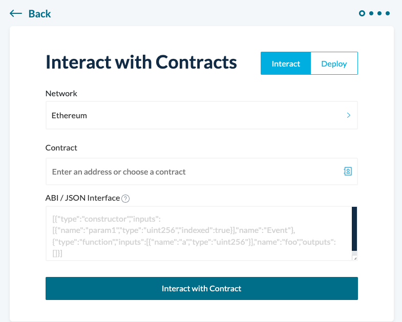
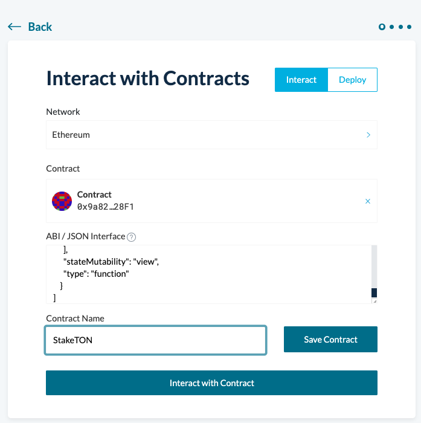
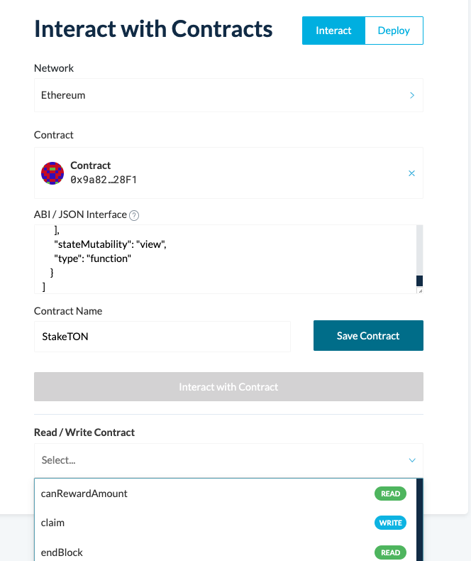
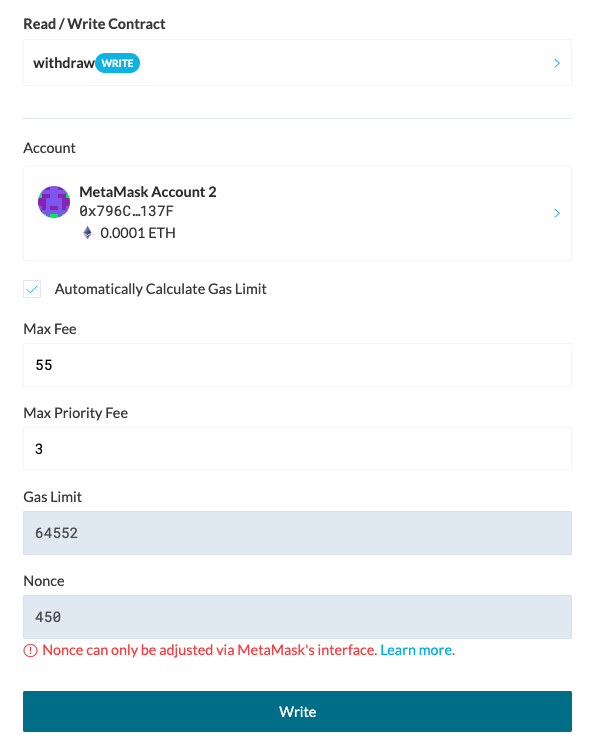

# TOS Mining
> 톤스타터 > TOS Mining 메뉴에서는 톤을 스테이킹하고 토스를 마이닝하는 락업 상품이 5개 존재합니다.

## TOS Mining 컨트랙 주소

| 이름 | address | etherscan|
| -------- | -------- | -------- |
| TON #1     | 0x9a8294566960Ab244d78D266FFe0f284cDf728F1     | [link](https://etherscan.io/address/0x9a8294566960Ab244d78D266FFe0f284cDf728F1#readProxyContract)     |
| TON #2     | 0x7da4E8Ab0bB29a6772b6231b01ea372994c2A49A     | [link](https://etherscan.io/address/0x7da4e8ab0bb29a6772b6231b01ea372994c2a49a#readProxyContract)       |
| TON #3     | 0xFC1fC3a05EcdF6B3845391aB5CF6a75aeDef7CeA     | [link](https://etherscan.io/address/0xfc1fc3a05ecdf6b3845391ab5cf6a75aedef7cea#readProxyContract)       |
| TON #4     | 0x9F97b34161686d60ADB955ed63A2FC0b2eC0a2a9     | [link](https://etherscan.io/address/0x9f97b34161686d60adb955ed63a2fc0b2ec0a2a9#readProxyContract)       |
| TON #5     | 0x21Db1777Dd95749A849d9e244136E72bd93082Ea     | [link](https://etherscan.io/address/0x21Db1777Dd95749A849d9e244136E72bd93082Ea#readProxyContract)       |

모든 TON Mining 컨트랙은  톤 스테이킹 할 수 있는 기간이 종료되었습니다.
TON Mining 컨트랙은 이자 (TOS) 클래임과 TON 원금을 인출 할 수 있는 기능을 제공합니다.

## 마이그립토 사이트를 통한 함수 실행 방법
위 컨트랙들은 이더스캔에 아래 함수가 나타나지 않으므로, 마이크립토 사이트를 통해 아래 함수를 실행하는 방법을 알려드립니다.

마이그립토 사이트를 로그인하시고, [TOOLS > Contracts](https://app.mycrypto.com/interact-with-contracts)로 이동하면, 아래와 같은 화면이 나옵니다.



- Contract : 위의 해당 컨트랙트의 address 를 입력합니다.
- ABI / JSON Interface : 기존에 데이타가 있다면 지우시고, 아래 내용을 입력합니다.
  ```
  [
    {
        "inputs": [],
        "name": "withdraw",
        "outputs": [],
        "stateMutability": "nonpayable",
        "type": "function"
      },
      {
        "inputs": [],
        "name": "claim",
        "outputs": [],
        "stateMutability": "nonpayable",
        "type": "function"
      },
      {
        "inputs": [
          {
            "internalType": "address",
            "name": "account",
            "type": "address"
          },
          {
            "internalType": "uint256",
            "name": "specificBlock",
            "type": "uint256"
          }
        ],
        "name": "canRewardAmount",
        "outputs": [
          {
            "internalType": "uint256",
            "name": "",
            "type": "uint256"
          }
        ],
        "stateMutability": "view",
        "type": "function"
      },
      {
        "inputs": [
          {
            "internalType": "address",
            "name": "",
            "type": "address"
          }
        ],
        "name": "userStaked",
        "outputs": [
          {
            "internalType": "uint256",
            "name": "amount",
            "type": "uint256"
          },
          {
            "internalType": "uint256",
            "name": "claimedBlock",
            "type": "uint256"
          },
          {
            "internalType": "uint256",
            "name": "claimedAmount",
            "type": "uint256"
          },
          {
            "internalType": "uint256",
            "name": "releasedBlock",
            "type": "uint256"
          },
          {
            "internalType": "uint256",
            "name": "releasedAmount",
            "type": "uint256"
          },
          {
            "internalType": "uint256",
            "name": "releasedTOSAmount",
            "type": "uint256"
          },
          {
            "internalType": "bool",
            "name": "released",
            "type": "bool"
          }
        ],
        "stateMutability": "view",
        "type": "function"
      },
      {
        "inputs": [],
        "name": "totalStakers",
        "outputs": [
          {
            "internalType": "uint256",
            "name": "",
            "type": "uint256"
          }
        ],
        "stateMutability": "view",
        "type": "function"
      },
      {
        "inputs": [],
        "name": "totalStakedAmount",
        "outputs": [
          {
            "internalType": "uint256",
            "name": "",
            "type": "uint256"
          }
        ],
        "stateMutability": "view",
        "type": "function"
      },
      {
        "inputs": [],
        "name": "startBlock",
        "outputs": [
          {
            "internalType": "uint256",
            "name": "",
            "type": "uint256"
          }
        ],
        "stateMutability": "view",
        "type": "function"
      },
      {
        "inputs": [],
        "name": "endBlock",
        "outputs": [
          {
            "internalType": "uint256",
            "name": "",
            "type": "uint256"
          }
        ],
        "stateMutability": "view",
        "type": "function"
      }
  ]
  ```
Contract Name에 StakeTON 를 입력합니다.

Interact with Contract 버튼을 누르시면



버튼 아래에 아래와 같이 "Read/Write Contract" 타이틀과 함수 선택박스를 확인하실 수 있습니다.



예를 들어, Withdraw 기능을 실행하시려고 한다면,

함수 선택박스에서, withdraw 를 선택하시고, account 에 주소를 입력하신후, Write 버튼을 누르시면 withdraw 기능을 실행하실 수 있습니다.




## 실행함수

### withdraw()

마이닝 종료 블록이 지난 후에 스테이킹 한 톤과 운영이익(레이어2의 시뇨리지로 받은 TOS)을 인출한다.

- 파라미터
  - 없음
- 결과값
  -  없음

***

### claim()

마이닝 종료 블록이 지난 후에 이자 TOS를 인출한다.

- 파라미터
  - 없음
- 결과값
  -  없음

***


## 조회함수

### canRewardAmount(address account, uint256 specificBlock)

받을 수 있는 이자를 조회한다.

- 파라미터
  - address account: 조회하려는 계정 주소
  - uint256 specificBlock: 조회하려는 시점의 블록 번호
- 결과값
  -  uint256: 받을 수 있는 이자 (wei unit, 18 decimals)

***

### userStaked(address account)

계정의 스테이킹 정보 확인

- 파라미터
  - address account: 조회하려는 계정 주소
- 결과값
  - uint256 amount  입금한 톤 양 (wei unit, 18 decimals)
  - uint256 claimedBlock 클래임한 블록
  - uint256 claimedAmount  클래임한 금액 (wei unit, 18 decimals)
  - uint256 releasedBlock  인출한 블록
  - uint256 releasedAmount 인출한 톤 양
  - uint256 releasedTOSAmount 인출한 토스 양 (wei unit, 18 decimals)
  - bool released   true이면 인출완료. false이면 인출안함

***

### totalStakers()

총 스테이킹한 계정 수 조회

- 파라미터
  - 없음
- 결과값
  -  uint256: 총 스테이킹한 계정 수

***

### totalStakedAmount()

총 스테이킹한 계정 수 조회

- 파라미터
  - 없음
- 결과값
  -  uint256: 총 스테이킹된 양 (wei unit, 18 decimals)

***

### startBlock()

마이닝 시작블록 조회

- 파라미터
  - 없음
- 결과값
  -  uint256: 시작블록 번호

***

### endBlock()

마이닝 종료블록 조회

- 파라미터
  - 없음
- 결과값
  -  uint256: 종료블록 번호

***

