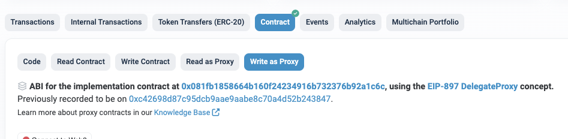

# TOS 스테이킹 관련 함수

> StakingV2Proxy 컨트랙을 통해 스테이킹, 언스테이킹을 할 수 있습니다.
- Mainnet StakingV2Proxy : [etherscan link](https://etherscan.io/address/0x14fb0933ec45ece75a431d10afaa1ddf7bfee44c#readProxyContract)

위의 이더스캔 링크 페이지의 **Write as Proxy** 페이지에서 실행 가능한 함수를 확인하실 수 있습니다.

### stake(uint256 _amount) 

락업기간을 지정하지 않고, TOS 스테이킹을 합니다.

- 파라미터
  - uint256 _amount: 스테이킹 양 (wei unit, 18 decimals) 
- 결과값
  - uint256 stakeId : 스테이킹 아이디 

*********

### stakeGetStos(uint256 _amount, uint256 _periodWeeks) 

락업기간 지정(스테이킹 종료일 지정)해서, TOS 스테이킹 하기 

- 파라미터
  - uint256 _amount : 스테이킹 양 (wei unit, 18 decimals)
  - uint256 _periodWeeks : 락업기간(주단위)
- 결과값
  - uint256 stakeId : 스테이킹 아이디 

*********

### increaseAmountForSimpleStake(uint256 _stakeId, uint256 _amount)

락업기간 지정하지 않고 스테이킹 한 경우의 **TOS 추가 스테이킹**

- 파라미터
  - uint256 _stakeId: 스테이크 아이디
  - uint256 _amount:  TOS 양 (wei unit, 18 decimals)
- 결과값
  -  없음

*********

### increaseAmountForSimpleStake(uint256 _stakeId, uint256 _amount)

락업기간 지정하지 않고(종료일이 없음) 스테이킹 한 경우의 **TOS 추가 스테이킹**

- 파라미터
  - uint256 _stakeId: 스테이크 아이디
  - uint256 _amount:  TOS 양 (wei unit, 18 decimals)
- 결과값
  -  없음

*********

### resetStakeGetStosAfterLock(uint256 _stakeId, uint256 _addTosAmount, uint256 _periodWeeks) 

락업기간이 있는 스테이킹의 경우(종료일이 있는 경우), 락업 기간 종료전에  **TOS 추가 스테이킹 하기** 

- 파라미터
  - uint256 _stakeId: 스테이크 아이디
  - uint256 _addTosAmount:  스테이크하는 추가 TOS양 (wei unit, 18 decimals)
  - uint256 _periodWeeks: 락업기간(주단위)
- 결과값
  -  없음

*********

### increaseBeforeEndOrNonEnd(uint256 _stakeId, uint256 _amount, uint256 _unlockWeeks) 

락업종료일이 지났거나 없는 경우, 특정 스테이킹 아이디에 **TOS 스테이킹 하기**

- 파라미터
  - uint256 _stakeId: 스테이크 아이디
  - uint256 _amount:  스테이크하는 추가 TOS양 (wei unit, 18 decimals)
  - uint256 _unlockWeeks: 추가 락업기간(주단위)
- 결과값
  -  없음

*********

### unstake(uint256 _stakeId)

이자와 원금 인출하기

- 파라미터
  - uint256 _stakeId: 스테이크 아이디 
- 결과값
  -  없음

*********

### claimForSimpleType(uint256 _stakeId, uint256 claimLtos) 

이자 인출하기

- 파라미터
  - uint256 _stakeId: 스테이크 아이디 
  -  uint256 claimLtos: 인출하려는 LTOS 양 (wei unit, 18 decimals)
- 결과값
  - 없음

*********

### 