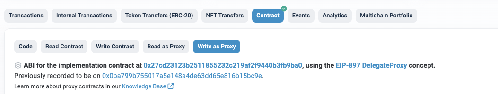

# Treasury

> TreasuryProxy 컨트랙을 통해, 본인이 보유하고 있는 TOS를 이더로 환전할 수 있습니다.

- TreasuryProxy :  [etherscan link](https://etherscan.io/address/0xd27a68a457005f822863199af0f817f672588ad6#writeProxyContract)

위의 이더스캔 링크 페이지의 ***Write as Proxy*** 페이지에서 실행 가능한 함수를 확인하실 수 있습니다.

## 조회 함수 (View) 

### [claimableEther(uint256 tosAmount)](https://etherscan.io/address/0xd27a68a457005f822863199af0f817f672588ad6#readProxyContract#F18)

입력된 토스량 따른 이더 환산 량

- 파라미터
  - uint256 tosAmount : 토스양 (wei unit, 18 decimals)
- 결과값
  -  uint256: 환전될때 받을 수 있는 이더량

*********

### [backingRateETHPerTOS()](https://etherscan.io/address/0xd27a68a457005f822863199af0f817f672588ad6#readProxyContract#F8)

1토스당 환전 이더 양 조회

- 파라미터
  - 없음 
- 결과값
  -  uint256: 1토스당 환전되는 이더양  (wei unit, 18 decimals)

*********

## 실행 함수 (Transaction)

### [claim(uint256 tosAmount)](https://etherscan.io/address/0xd27a68a457005f822863199af0f817f672588ad6#writeProxyContract#F6)

ETH redeem 기능: 본인 토스를 버닝하고 이더로 환전함

- 파라미터
  - uint256 tosAmount : 토스양 (wei unit, 18 decimals)
- 결과값
  -  없음

****

### [setClaimPause(bool _pause)](https://etherscan.io/address/0xd27a68a457005f822863199af0f817f672588ad6#writeProxyContract#F21)

환전 기능 중지/재시작 실행 하기, PolicyOwner 만 실행 가능한 함수

- 파라미터
  - bool _pause : true면 환전중지, false면 환전가능
- 결과값
  - 없음

****

### [setClaimableStartTime(uint32 _startTime)](https://etherscan.io/address/0xd27a68a457005f822863199af0f817f672588ad6#writeProxyContract#F22)

환전 시작 시간 설정 하기, PolicyOwner 만 실행 가능한 함수

- 파라미터
  -  uint32 _startTime : 환전 시작시간
- 결과값
  - 없음

*********

