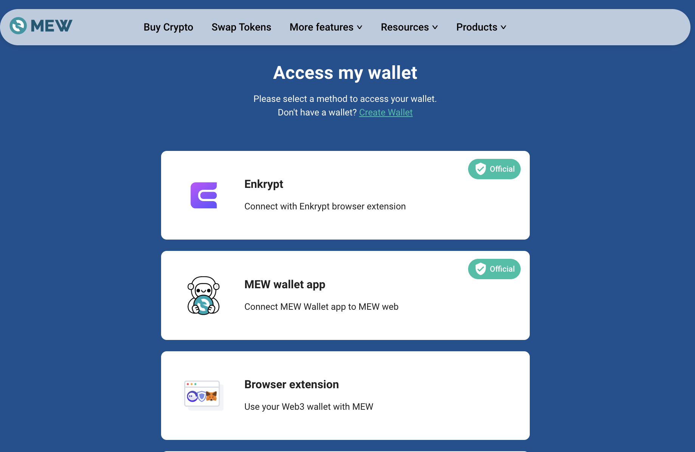
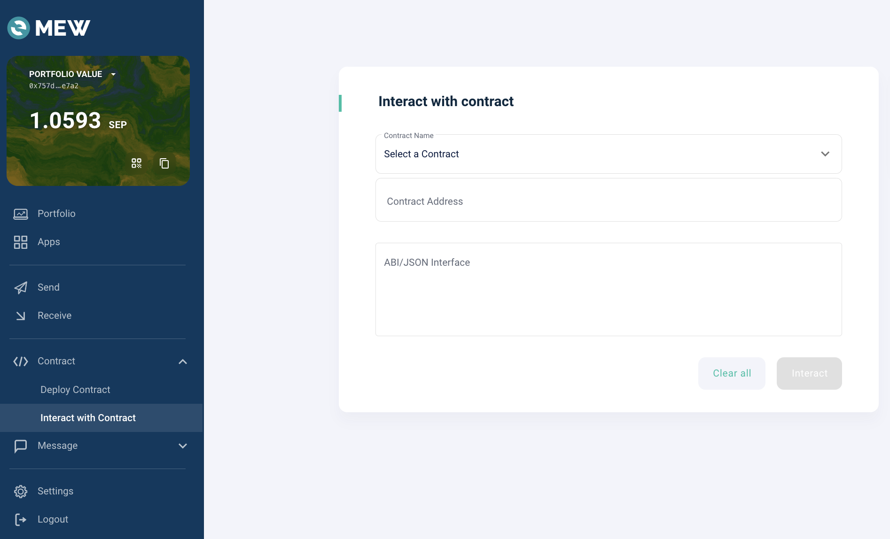
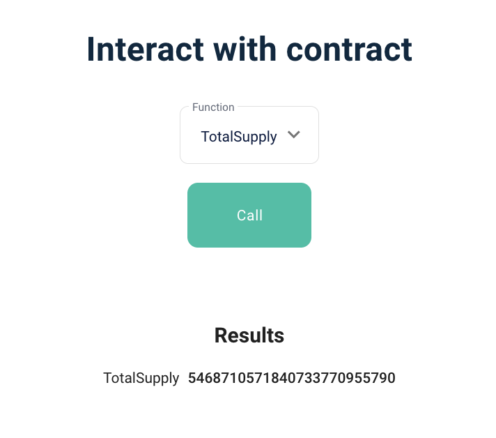

# sTOS 조회 방법

> LockTOSProxy 컨트랙을 통해 특정 계정이 보유하고 있는 SsTOS 잔액 및 총 sTOS 발행량을 확인할 수 있습니다.  LockTOSProxy 컨트랙의 경우는 이더스캔에서 잔액조회 관련 함수가 표시되지 않기 때문에 마이이더월렛과 같은 사이트를 이용하여 조회를 할 수 있습니다.

[마이이더 월렛](https://www.myetherwallet.com/wallet/dashboard) 사이트에 로그인합니다.   메타마스크 지갑을 사용하시는 사용자는 아래 ‘Browser extension’ 메뉴를 클릭하여 지갑연결을 할 수 있습니다.



Interact with contract 메뉴로 이동합니다.




컨트랙 주소에 LockTOSProxy 주소를 입력하고, AIB 영역에 아래 내용을 입력합니다.
LockTOSProxy 주소 (mainnet): 0x69b4A202Fa4039B42ab23ADB725aA7b1e9EEBD79

```
[
	{
	  "inputs": [
	    {
	      "internalType": "address",
	      "name": "_addr",
	      "type": "address"
	    }
	  ],
	  "name": "balanceOf",
	  "outputs": [
	    {
	      "internalType": "uint256",
	      "name": "balance",
	      "type": "uint256"
	    }
	  ],
	  "stateMutability": "view",
	  "type": "function"
	},
	 {
	  "inputs": [],
	  "name": "totalSupply",
	  "outputs": [
	    {
	      "internalType": "uint256",
	      "name": "",
	      "type": "uint256"
	    }
	  ],
	  "stateMutability": "view",
	  "type": "function"
	}
]
```


## 함수 

다음 버튼을 클릭하면,  위에 입력한 ABI에 명시되어 있는 함수를 호출할 수 있습니다.



**************

### balanceOf(address _addr)

특정 계정의 STOS 잔액을 조회합니다.

- 파라미터 
  - address _addr: 조회대상이 되는 주소 
- 결과값 
  - 특정 계정의 STOS 잔액 (wei unit, 18 decimals)

*********

### totalSupply() 

총 STOS 발행량을 확인할 수 있습니다.

- 파라미터: 없음
- 결과값
  - 총 STOS 발행량 (wei unit, 18 decimals)

**************

### 