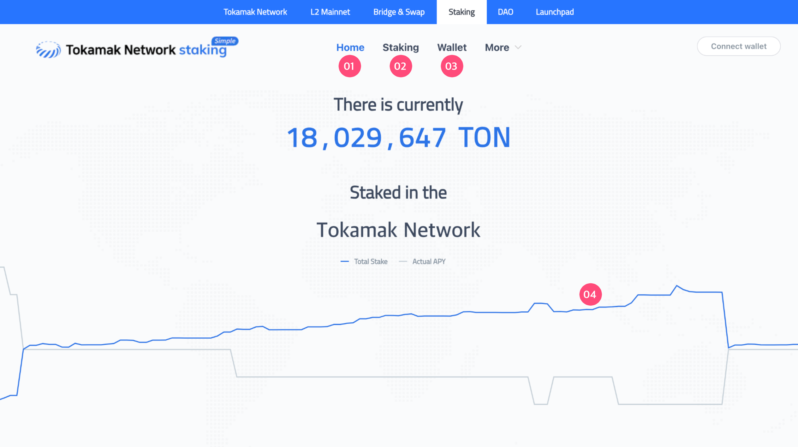

# Simple staking


Service URL

* Website: [https://simple.staking.tokamak.network](https://simple.staking.tokamak.network/)
* Github (contract): [https://github.com/tokamak-network/ton-staking-v2](https://github.com/tokamak-network/ton-staking-v2)
* Contract addresses: [link](contract-addresses.md)&#x20;


### 1. Features

Tokamak Network’s staking is used to select the DAO committee members that can vote on agendas. Here's how it works:

* Users can stake their TON or WTON on DAO candidates to earn staking rewards and support the DAO candidate to become one of the DAO committee members.
* The three DAO candidates with the highest staking can become DAO committee members, where they can vote on DAO agendas.

### 2. Page Information

<figure><figcaption>
The initial screen of the staking page
</figcaption></figure>

1. **Home**

* Click the Connect Wallet button to link your Metamask or Trezor wallet.
* The blue graph shows the amount staked on Tokamak network by the staker each day, and the grey graph shows the actual APY each day. If you hover your mouse over the graph, you can see the total amount of daily staking and the actual APY.

2. **Staking**

* On the staking page, you can check information about the DAO candidates. If your wallet is connected, you can click the blue arrow on the right of each operator to see detailed information about the DAO candidate and the staking button. If your wallet is not connected, you can only see the details of the operator.
* Once your wallet is connected, you can click the Staking button to stake your TON (or WTON) to a DAO candidate.

3. **Account**

* The account page provides information about the assets you hold.
* To use this service, you must first log in through the wallet connection at the top right.

The information provided is as follows:

* Total Staked: This is the total of staked TON.
* Pending Withdrawal: This is the total amount of Unstake TON. This amount can only be withdrawn after the withdrawal delay period set by the DAO candidate (default is after 93,046 blocks, about 14 days) has passed.
* History: This shows the transaction history related to staking. This information includes transaction hash, related DAO candidate (Candidate), type, amount, and execution time.

<figure><figcaption>
Wallet and history
</figcaption></figure>

### **3. Login**

You must first log in through wallet connection to access some features like staking and account information. You can select the wallet connection method by clicking the wallet connection button at the top right of the screen.

* Log in with Metamask&#x20;
  * Make sure you are connected to the Ethereum mainnet network. Then click the Connect Wallet button.
  * In the pop-up window, click the Metamask icon.
  * In the list of browser extensions, click the Metamask icon and select the account to connect to the service.
*   Log in with Trezor&#x20;

    * Connect to Trezor wallet

    <figure><figcaption>
Wallet option
</figcaption></figure>
