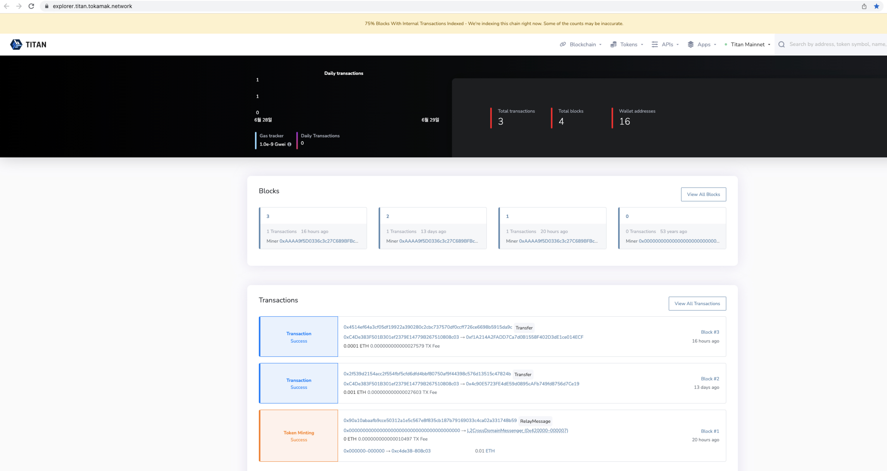

# Add Titan on Metamask

This section will guide you through the step-by-step process of installing the MetaMask wallet in your Chrome browser. Additionally, we will delve into the procedure for adding the Titan network to the MetaMask wallet.

### How to Install MetaMask in Chrome

<figure><figcaption></figcaption></figure>

1. Open the Chrome browser and Login to  Google ([https://www.google.com/](https://www.google.com/))
2. After login, click the button at the top right as shown in the screenshot
3. Click on Extensions
4. Click Visit Chrome Web Store

<figure><figcaption></figcaption></figure>

* The Chrome Web Store window will open once you have followed the earlier instructions. Like in the screenshot above, you will notice a search bar in the Chrome Web Store's top left corner. Click on the search bar and enter "MetaMask" to initiate a search for the extension.

<figure><figcaption></figcaption></figure>

* When you search for MetaMask, you will see a screen resembling the one above. From there, click on the MetaMask extension to proceed.

<figure><figcaption></figcaption></figure>

* If you click MetaMask, the above screen will appear. Click 'Add to Chrome' here.

<figure><figcaption></figcaption></figure>

* If MetaMask is properly installed, you can see that the Add to Chrome button has been changed to Remove from Chrome, as shown above.

<figure><figcaption></figcaption></figure>

1. After installing MetaMask, click the button on the top right, as shown in the screenshot
2. Click Extensions
3. Click Manage Extensions

<figure><figcaption></figcaption></figure>

* The extension management window appears as in the following screenshot, and if the MetaMask side is marked with a red box, the installation is complete.

### How to Add Titan Network in MetaMask (Method 1)

<figure><figcaption></figcaption></figure>

* If you access [https://explorer.titan.tokamak.network](https://explorer.titan.tokamak.network), following screen will appear. Scroll down the screen.

<figure><figcaption></figcaption></figure>

* If you scroll down, there is a MetaMask icon and Add Titan Mainnet like a red box at the bottom, click the red box.

<figure><figcaption></figcaption></figure>

* When clicked, a Metamask pop-up opens as shown screenshot. Scroll down here.

<figure><figcaption></figcaption></figure>

* If you scroll down, you will see the Approve button as follows, press the Approve button.

<figure><figcaption></figcaption></figure>

* After pressing the Approve button, the following screen will appear. Click the Switch Network button on the screen.

<figure><figcaption></figcaption></figure>

* If you click the switch network button, you can see that the Titan Mainnet network has been added as follows.

### How to Add Titan Network in MetaMask (Method 2)

* Click on the Metamask icon you installed earlier. After that, click the Ethereum Mainnet button.

<figure><figcaption></figcaption></figure>

If you click Ethereum Mainnet, the above screen will appear. Click the Add Network button.&#x20;

<figure><figcaption></figcaption></figure>

When you click the Add Network button, the following screen appears. On the next screen, click Add Network Manually.

<figure><figcaption></figcaption></figure>

* Once you click Add Network Manually, the following screen will appear.

1. Network name : Titan
2. New RPC URL :[https://rpc.titan.tokamak.network](https://rpc.titan.tokamak.network)
3. Chain ID : 55004
4. Currency symbol : ETH
5. Block explorer URL (Optional) :[https://explorer.titan.tokamak.network](https://explorer.titan.tokamak.network)

* Fill in the fields with the above data.

<figure><figcaption></figcaption></figure>

* Click the save button.

<figure><figcaption></figcaption></figure>

* After saving, you can see that the Titan network gets added, as shown above.
