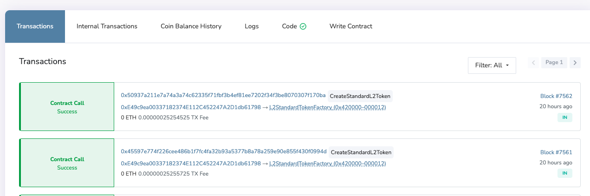
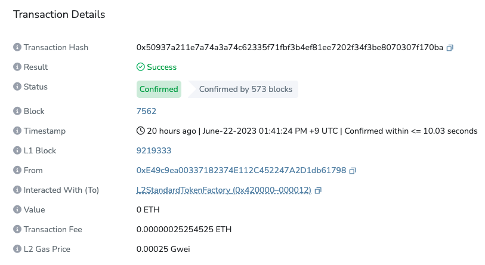
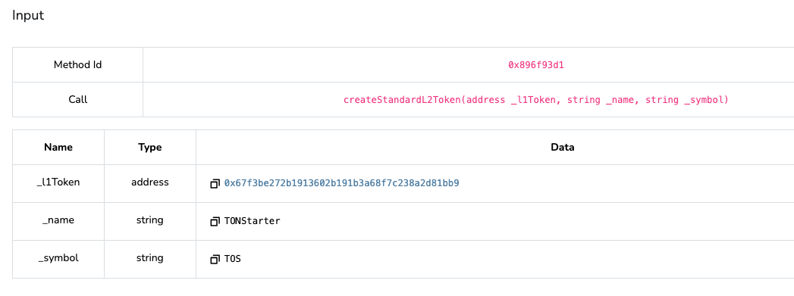
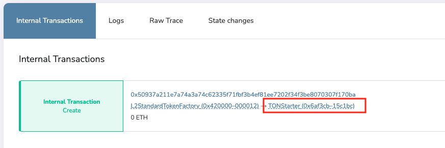

# How to create a standard ERC20 token in L2

We will cover two approaches: creating a standard ERC20 token and developing a customized ERC20 token.

### How to create Standard ERC20 Token

* You can use the `L2StandardTokenFactory` contract to create ERC20 tokens conveniently.

```
L2StandardTokenFactory address: 0x420000000000000000000000000000000000000000000012
```

* Using Titan block explorer, navigate to the `L2StandardTokenFactory` contract page. ([Titan](https://explorer.titan.tokamak.network/) / [Titan Sepolia](https://explorer.titan-sepolia.tokamak.network/address/0x4200000000000000000000000000000000000012/write-contract#address-tabs))
* You can see the Write Contract tab in the middle of the screen, as shown below.

<figure><figcaption></figcaption></figure>

1. Click the Connect wallet button to connect your wallet.
2. Use the `createStandardL2Token` first function in `L2StandardTokenFactory.` Enter each element in the input box below and click the Write button:&#x20;
   * `_L1Token(address)`: The address of the L1 token to be connected through the bridge.
   * `_name(string)`: Token name
   * `_symbols(string)`: Token symbols
3. You can check the L2 token address through the event of the transaction executed through (2) above.


* You can check the transaction sent on the Transactions tab in the middle of the `L2StandardTokenFactory` contract page.

<figure><figcaption></figcaption></figure>


* You can click on the transaction that takes you to the Transaction details page, where you can see the details of the transaction.

<figure><figcaption></figcaption></figure>


* You can see the value you entered in the middle of the transaction page. You'll see what you entered, as shown in the image below.

<figure><figcaption></figcaption></figure>


* And just below that, you'll see the Internal Transactions tab. In the below screenshot, the red boxed area is the `L2Token` that was created. The screenshot below shows the name, but it might look like an address in your case.

<figure><figcaption></figcaption></figure>


* Let's see how to verify the L2 token shown above (this part is not mandatory).
* This method is for those who know using hardhat. (If you don't have experience using hardhat, please check the verify request box when registering the bridge token below, and the team will verify it.)
* The code is available at [https://github.com/tokamak-network/tokamak-titan/tree/L2Token\_verify/packages/contracts](https://github.com/tokamak-network/tokamak-titan/tree/L2Token\_verify/packages/contracts)
* Following code can be used to verify the contract:

```bash
npx hardhat verify {L2Token address}  0x4200000000000000000000000000000000000010 {L1Token address} {name} {symbol} --network titan 
```


After creating an L2 token, you need to register on [Bridge](https://bridge.tokamak.network/). Fill in the token information on the token registration form ([link to the token registration form on Bridge](https://forms.gle/actJrRuAtHT7ycG5A)) and submit it. The team will check it, register it on Bridge, and notify you of the result.



### How to create a Custom ERC Token

* With the `L2StandardTokenFactory`, you can create a standard ERC20 with `decimals` 18 associated with L1. However, if your L1 token is not decimal 18, you cannot use `L2StandardTokenFactory`.
* In this case, you can inherit `L2StandardERC20` and add the necessary functions to create a contract.

```bash
mkdir createCustomToken
cd $_
npm install hardhat@2.9.6 --save-dev
npx hardhat init
npm install @tokamak-network/titan-contracts @openzeppelin/contracts @nomiclabs/hardhat-etherscan@^3.1.5 --save

// Modify the hardhat.config.ts or hardhat.config.js version to 0.8.9 or higher.
```

* This is an example `hardhat.config.ts` file.

```tsx
import * as dotenv from "dotenv";

import { HardhatUserConfig, task } from "hardhat/config";
import "@nomiclabs/hardhat-etherscan";
import "@nomiclabs/hardhat-waffle";
import "@typechain/hardhat";
import "hardhat-gas-reporter";
import "solidity-coverage";

dotenv.config();

// This is a sample Hardhat task. To learn how to create your own go to
// <https://hardhat.org/guides/create-task.html>
task("accounts", "Prints the list of accounts", async (taskArgs, hre) => {
  const accounts = await hre.ethers.getSigners();

  for (const account of accounts) {
    console.log(account.address);
  }
});

// You need to export an object to set up your config
// Go to <https://hardhat.org/config/> to learn more

const config: HardhatUserConfig = {
  solidity: "0.8.9",
  networks: {
    titan: {
      url: `${process.env.ETH_NODE_URI_TITAN}`,
      accounts: [`${process.env.PRIVATE_KEY}`],
      chainId: 55004 
    },
    titangoerli: {
      url: `${process.env.ETH_NODE_URI_TITAN_GOERLI}`,
      accounts: [`${process.env.PRIVATE_KEY}`],
      chainId: 5050 
    },
  },
  gasReporter: {
    enabled: process.env.REPORT_GAS !== undefined,
    currency: "USD",
  },
  etherscan: {
		apiKey: { 
      "titangoerli": "verify",
      "titan": "verify"
    } ,
    customChains: [
      {
        network: "titangoerli",
        chainId: 5050,
        urls: {
          apiURL: "<https://goerli.explorer.tokamak.network/api>",
          browserURL: "<https://goerli.explorer.tokamak.network>"
        }
      },
      {
        network: "titan",
        chainId: 55004,
        urls: {
          apiURL: "<https://explorer.titan.tokamak.network/api>",
          browserURL: "<https://explorer.titan.tokamak.network>"
        }
      }
    ]  
  },
};

export default config;
```

* Below is `contracts/L2CustomERC20.sol` contract code.

```solidity
// SPDX-License-Identifier: MIT
pragma solidity >=0.5.16 <0.9.0;

import { L2StandardERC20 } from "@tokamak-network/titan-contracts/standards/L2StandardERC20.sol";

contract L2CustomERC20 is L2StandardERC20 {
    constructor(
	      address _l1Token,
	      string memory _name,
	      string memory _symbol
    ) L2StandardERC20(0x4200000000000000000000000000000000000010, _l1Token, _name, _symbol){

	}

    function decimals() public pure override returns (uint8) {
	        return 6;
    }
}
```

* Following is a sample script `scripts/deploy.ts,` to deploy the `L2CustomERC20` contract created above.

```tsx
import { ethers } from "hardhat";

async function main() {
  const L1TokenAddress = "0x07865c6e87b9f70255377e024ace6630c1eaa37f";
  const TokenName = "USDC Sample";
  const TokenSymbol = "USDC";

  // We get the contract to deploy
  const L2CustomERC20Factory = await ethers.getContractFactory("L2CustomERC20");
  const L2CustomERC20 = await L2CustomERC20Factory.deploy(
    L1TokenAddress,
    TokenName,
    TokenSymbol
  );

  await L2CustomERC20.deployed();

  console.log("L2CustomERC20 deployed to:", L2CustomERC20.address);
}

// We recommend this pattern to be able to use async/await everywhere
// and properly handle errors.
main().catch((error) => {
  console.error(error);
  process.exitCode = 1;
});
```

* You can compile, deploy, and verify as follows.

```bash
// To compile 
npx hardhat compile 

// To deploy
npx hardhat run ./scripts/deploy.ts --network titan

// To verify
npx hardhat verify {L2Token주소} {L1Token주소} {name} {symbol} --network networkName  
```


After creating an L2 token, you can register on [Bridge](https://bridge.tokamak.network/). Please fill in the token information on the token registration form ([link to the token registration form on Bridge](https://j8vmrrhl32u.typeform.com/to/w57E5otJ)) and submit it. The team will check and register your token on Bridge and notify you of the result.


