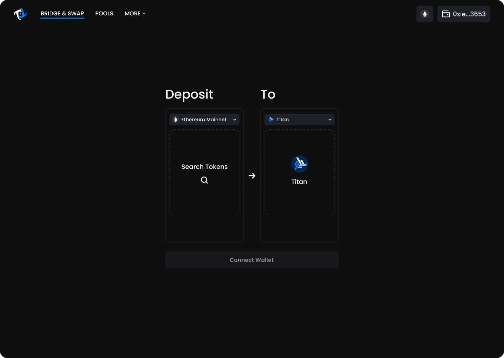
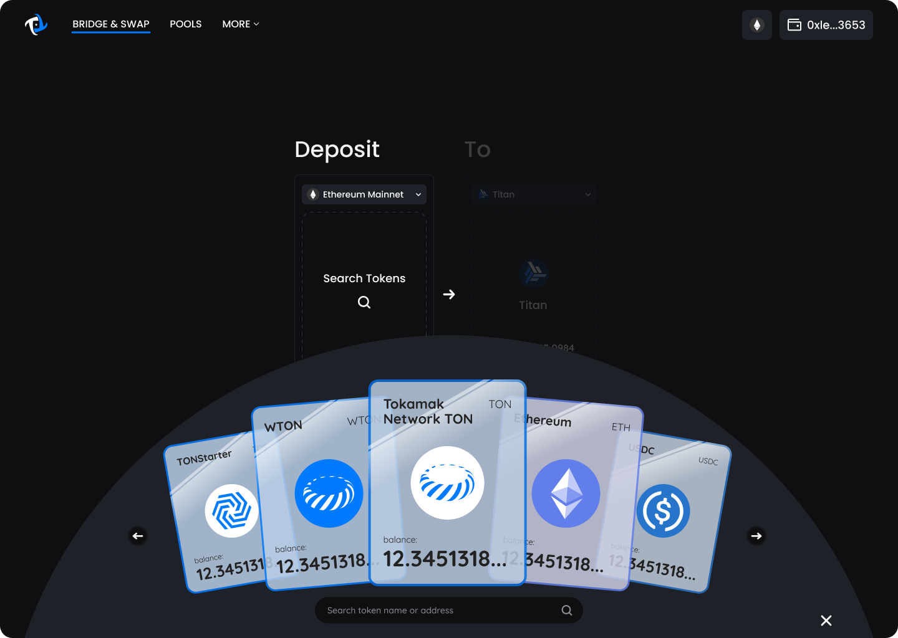
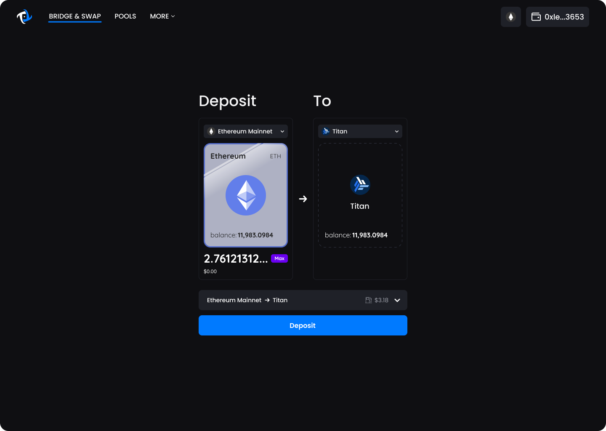

# Deposit

1. In order to perform a deposit, the origin network (left) needs to be Ethereum and the destination network (right) needs to be Titan.&#x20;

<figure><figcaption>
For deposit, make sure the origin network (left) is set to Ethereum and destination network (right) is set to Titan.
</figcaption></figure>

2. Next you will need to select which tokens you’d like to deposit. You can do this by clicking on the card placeholder which will bring up an interactive trading card hand. Select the token you’d like to deposit.&#x20;


WTON is not supported on Titan Network, if selected. it will be unwrapped to TON and then deposited.


<figure><figcaption>
Choose the token to deposit from list of tokens.
</figcaption></figure>

3. Once the token has been selected, input the amount you wish to deposit.&#x20;
4. Depending on the token, you may have to approve your tokens to be used by Tokamak Bridge.&#x20;
5. Once the transaction details is checked, click the Deposit button to bring up the final confirm screen.&#x20;

<figure><figcaption>
Input the deposit amount and check the gas fee.
</figcaption></figure>

6. Review details then click Confirm Deposit to bring up the Metamask confirm window. &#x20;


Your deposit may take up to 20 minutes to complete. If the deposit doesn't arrive, please contact us through help request form located under "MORE" menu. &#x20;


<figure><figcaption></figcaption></figure>
