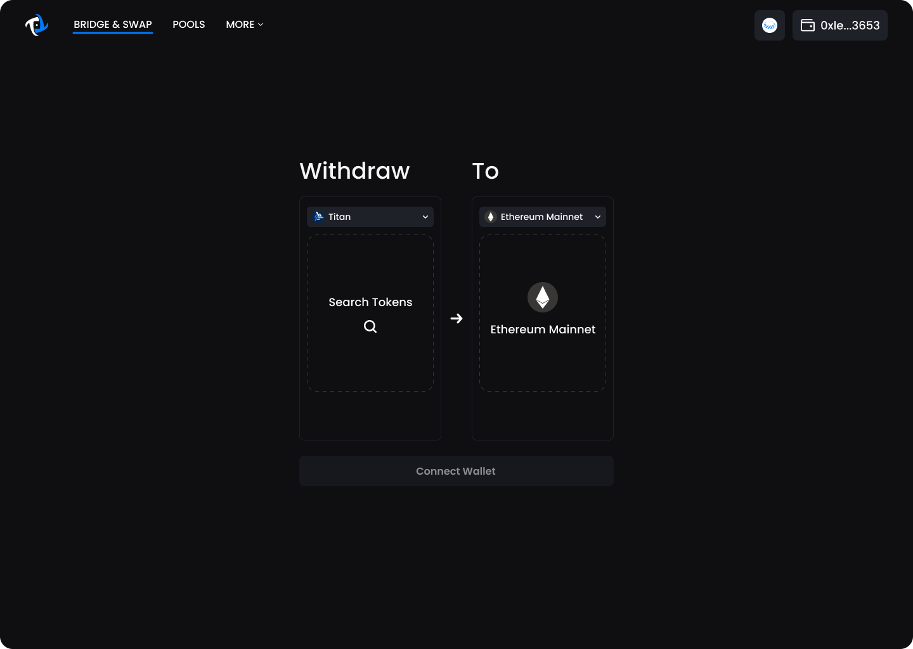
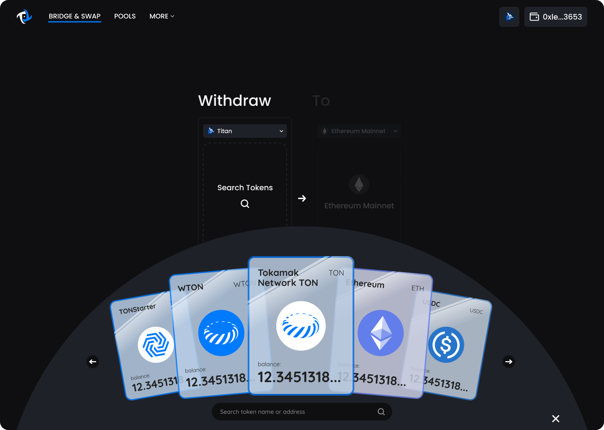
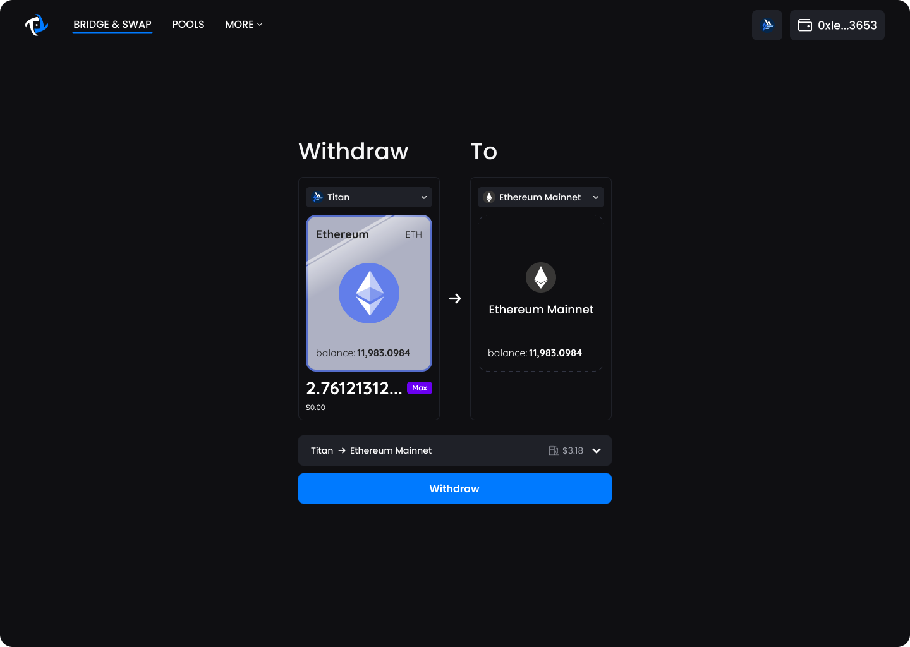

# Withdraw

1. In order to perform a withdraw, the origin network (left) needs to be Titan and the destination network (right) needs to be Ethereum.&#x20;

<figure><figcaption>
For withdrawal, make sure the origin network (left) is set to Titan and destination network (right) is set to Ethereum
</figcaption></figure>

2. Next you will need to select which tokens you’d like to withdraw. You can do this by clicking on the card placeholder which will bring up an interactive trading card hand. Select the token you’d like to withdraw.&#x20;

<figure><figcaption>
Choose the token to withdraw from list of tokens.
</figcaption></figure>

3. Once the token has been selected, input the amount you wish to withdraw.
4. For further details related to this transaction, click on the transaction details drop down.&#x20;
5. Once the transaction details is checked, click the Withdraw button to bring up the final confirm screen.

<figure><figcaption>
Input the withdrawal amount and check the gas fee.
</figcaption></figure>

6. Review the details and then click "Confirm Deposit" to bring up the MetaMask confirmation window. Once the transaction is confirmed, it will initiate the withdrawal process. This process is the first of the four steps required to withdraw assets from Titan to Ethereum.

<figure><figcaption></figcaption></figure>


Withdrawals take a significant time to complete the transaction, expect the process to take **7** days. After 7 days, you have to Claim Withdraw to finalize the asset transfer on Ethereum.



Four steps required to withdraw assets from Titan to Ethereum:&#x20;

1. Initiate withdraw: A transaction is sent from the Titan to the Bridge on Ethereum to request the withdrawal.
2. Wait for \~11 minutes for rollup: The transaction sent from Titan has to be rolled up by the sequencer on Ethereum, which takes 11 minutes or more.
3. Wait for 7 days: To ensure that the sequencer is not malicious, we need to wait 7 days to finalize the rolled-up message on Ethereum. This period is also known as the challenge period.
4. Claim withdrawal: This step finalizes the withdrawal on Ethereum, and assets will be transferred from the bridge to the specified account on Ethereum.


7. After initiate withdraw transaction is confirmed, wait \~11 minutes for the transaction and the state root to be rolled up on Ethereum network by the sequencer.&#x20;

<figure><figcaption></figcaption></figure>


You can use [Bridge History](../wallet.md#bridge-history) to check on the status of the withdraw and deposit transactions at any time.&#x20;


8. After the sequencer rolls up the transaction and the state root on the Ethereum Network, you must wait for 7 days. To receive a notification when the waiting period is over, you can click on the Google Calendar logo or "Add to Google Calendar" to set an alarm.&#x20;

<figure><figcaption></figcaption></figure>

9.  After 7 days have passed, you can finally claim your withdrawal. This will move the asset from the bridge to the specified  account.

    <figure><figcaption></figcaption></figure>

