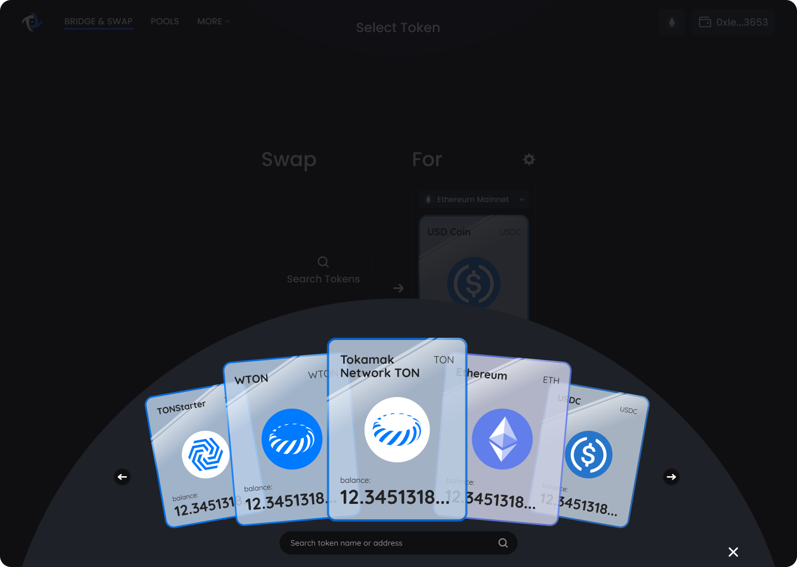
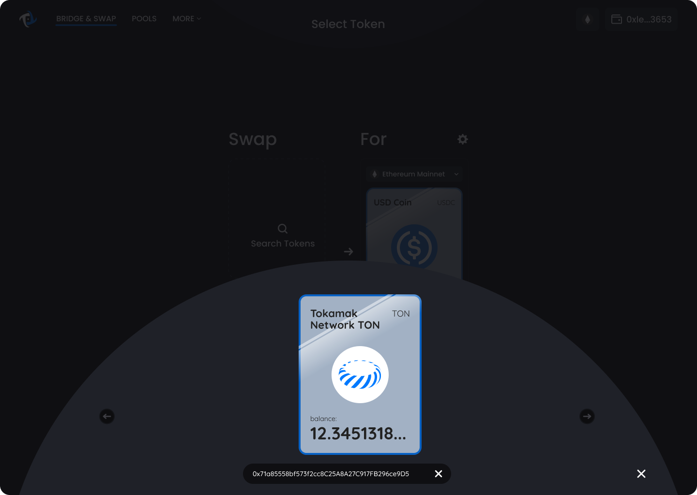

# Search

## _**Search for a token listed on Tokamak Bridge**_

1. In order to search tokens, open the card selection interface and click on the search bar located at the bottom of the screen.&#x20;

<figure><figcaption>
Search for a token using the search bar located on the bottom of the page.
</figcaption></figure>

2. Enter the token address that you would like to search for.&#x20;

<figure><figcaption>
Select the token to be used in Tokamak Bridge
</figcaption></figure>

## _**Add a token that is not listed on Tokamak Bridge**_


To officially add a token to Tokamak Bridge, fill out the "[Tokamak Bridge Token Support Request form](https://forms.gle/actJrRuAtHT7ycG5A)".


1. In order to add a token not listed on Tokamak Bridge, open the card selection interface and click on the search bar located at the bottom of the screen.&#x20;

<figure><figcaption>
Search for a token using the search bar located on the bottom of the page.
</figcaption></figure>

2. Enter the desired token address.
3. Agree to the warning message; “This token isn’t swapped on leading U.S. centralized exchanges or frequently swapped on Tokamak Bridge. Always conduct your own research before trading.”

<figure><figcaption>
Check the warning
</figcaption></figure>

3. Select the token to be used in Tokamak Bridge.

<figure><figcaption>
Select the token to be used in Tokamak Bridge
</figcaption></figure>
