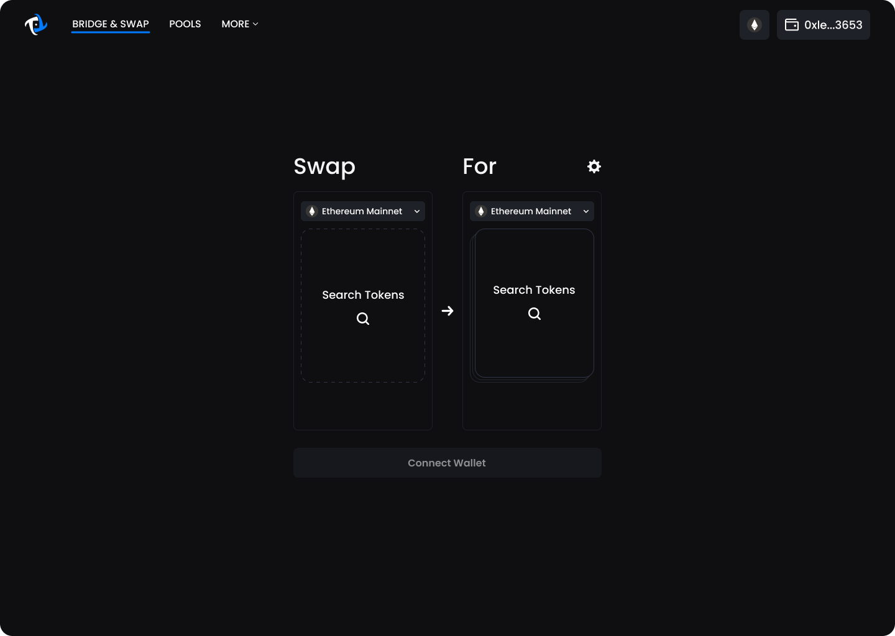
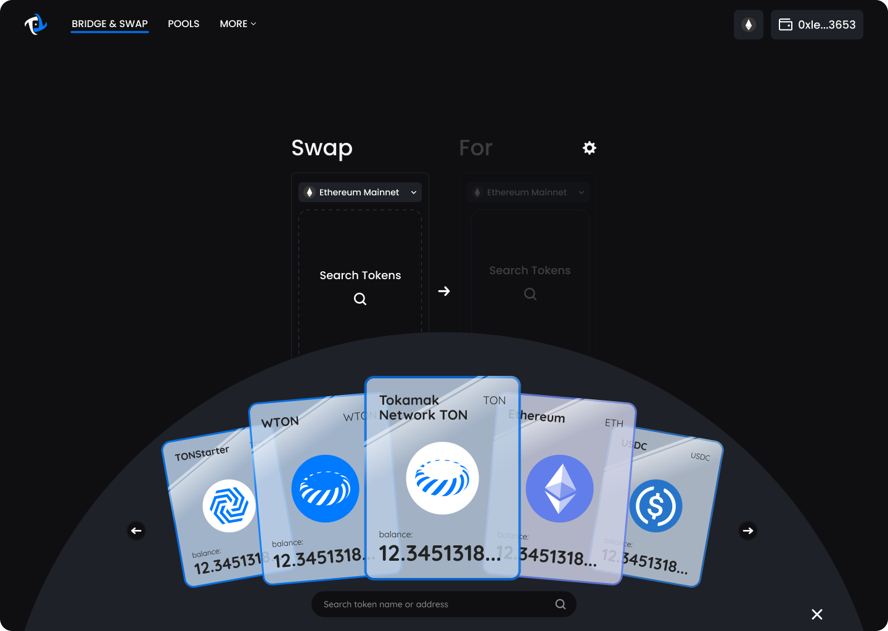
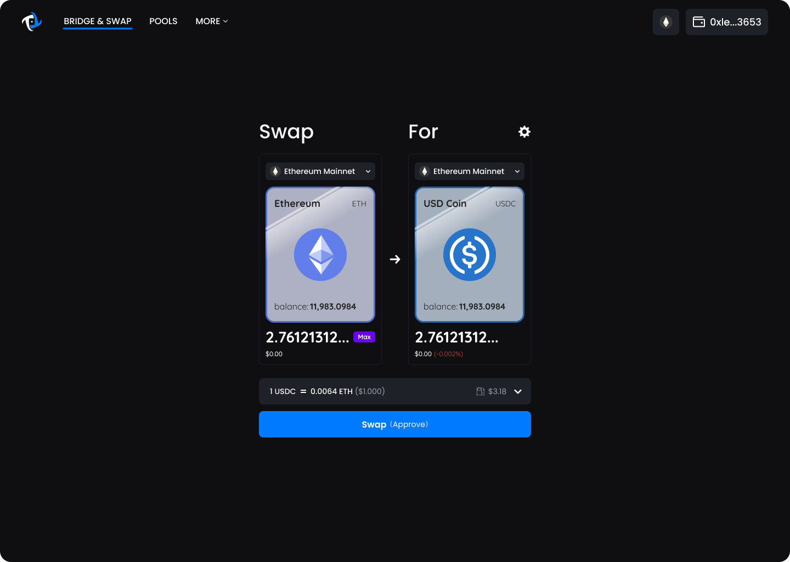
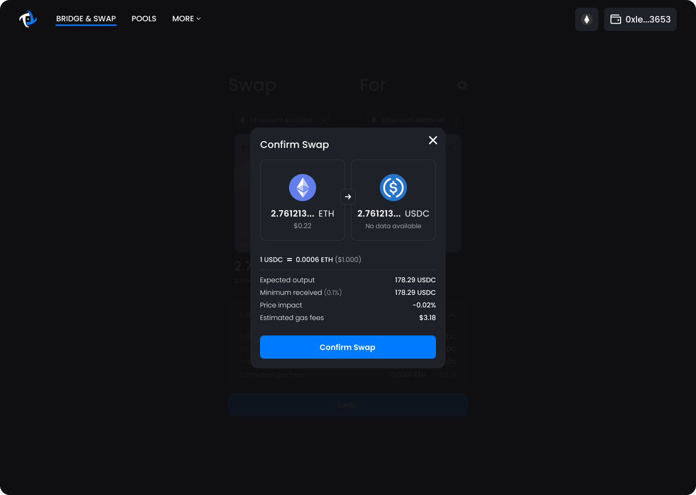

# Swap


On Ethereum network, TON cannot be directly swapped to other tokens using Tokamak Bridge. Please wrap it to WTON first and then swap using WTON. We will support direct swap for TON in the future.



Swap and Pools in Tokamak bridge is a service that utilizes Uniswap v3 contracts. If your network is set to Ethereum network, it will use Uniswap v3 contracts deployed by Uniswap. If it is set to Titan network, it will use Uniswap v3 contracts deployed by Tokamak Network.


1. In order to perform a Swap, Wrap or Unwrap, the origin (left) and destination (right) network need to be the same.

<figure><figcaption>
For swap (wrap 또는 unwrap), make sure the origin (left) and destination (right) network are the same.
</figcaption></figure>

2. Next you will need to select which tokens you’d like to swap for. You can do this by clicking on the card placeholder which will bring up an interactive trading card hand. Select the token you’d like to swap.&#x20;
3. Now you will need to select the desired token you want to receive. Do this by selecting the other trading card placeholder interface on the right.

<figure><figcaption>
Choose the token to swap from list of tokens.
</figcaption></figure>

4. Once both tokens have been selected, input the amount you wish to swap, and the receiving token amount will automatically be calculated for you and vice versa.&#x20;

<figure><figcaption>
Input the swap amount and check the output amount.
</figcaption></figure>

5. For further details related to this transaction, click on the transaction details drop down. Users can check slippage setting, price impact + use advanced setting => set slippage + transaction deadline.&#x20;
6. Once the transaction details is checked, click the Swap, Wrap or Unwrap button to bring up the final confirm screen.&#x20;

<figure><figcaption>
Click Confirm Swap, Wrap or Unwrap and sign your transaction using Metamask.
</figcaption></figure>

7. Review details then click Confirm Swap, Wrap or Unwrap to bring up the Metamask confirm window.
